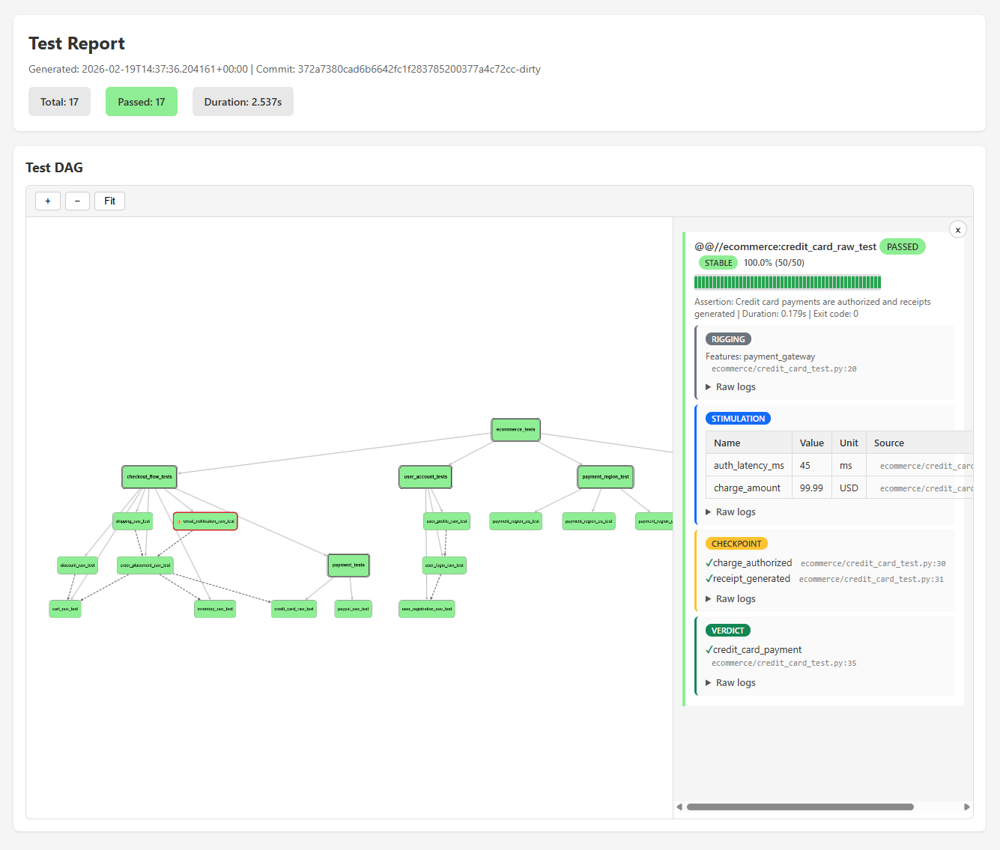

# bazel_test_sets

Bazel rules for large-scale test orchestration with DAG-based dependency management, intelligent test selection, and test maturity tracking.

## What it does

Standard test runners treat tests as independent, unordered units. In practice, tests have dependencies: a login test is pointless if registration is broken, and a checkout test is meaningless if the cart doesn't work.

**bazel_test_sets** lets you:

- **Declare dependencies between tests** so failures propagate correctly and dependents are skipped
- **Organize tests into hierarchical sets** that nest arbitrarily deep
- **Choose execution strategies** &mdash; run everything (diagnostic) or fail fast (detection), optionally narrowed to tests correlated with changed files (regression)
- **Track test maturity** through a burn-in lifecycle backed by statistical testing (SPRT)
- **Generate parameterized tests** from matrices or variant configurations
- **Collect structured measurements** and produce JSON/HTML reports with an interactive DAG visualization

## Strengths and limitations

This workflow is well suited for large-scale testing:

- **Reliability over correctness** &mdash; we reason about test results in terms of statistical reliability (burn-in, flaky detection) rather than treating every failure as a correctness signal.
- **Test sets bridge requirements and tests** &mdash; assertions on test sets map directly to product requirements, making test outcomes meaningful beyond pass/fail.
- **Hierarchical decomposition** &mdash; breaking large suites into nested test sets makes it easy to understand how an individual test failure affects overall product quality.

However, the current implementation has limitations that make it unsuitable for production use at scale without further investment:

- **JSON-in-repo history** &mdash; historic test data is stored as JSON files committed to the repository. At scale this should be replaced with an external results database.
- **Self-contained HTML reports** &mdash; reports are single-file HTML documents. While they include an interactive DAG visualization, at scale a dedicated dashboard backed by a results database would be more practical.
- **Local execution only** &mdash; all tests run locally within this repository. For large-scale testing, Bazel remote execution should be enabled.

## Quick start

### 1. Add the dependency

```starlark
# MODULE.bazel
bazel_dep(name = "test_sets_bazel_rules", version = "0.1.0")
git_override(
    module_name = "test_sets_bazel_rules",
    remote = "https://github.com/svdh2/bazel_test_sets.git",
    commit = "<commit-sha>",
)
```

### 2. Wrap tests with DAG metadata

```starlark
# BUILD.bazel
load("@rules_python//python:defs.bzl", "py_test")
load("@test_sets_bazel_rules//rules:test_set_test.bzl", "test_set_test")
load("@test_sets_bazel_rules//rules:test_set.bzl", "test_set")

py_test(name = "registration_raw_test", srcs = ["registration_test.py"])
py_test(name = "login_raw_test", srcs = ["login_test.py"])

test_set_test(
    name = "registration",
    test = ":registration_raw_test",
    assertion = "User can register a new account",
)

test_set_test(
    name = "login",
    test = ":login_raw_test",
    assertion = "Registered user can log in",
    depends_on = [":registration"],  # skipped if registration fails
)

test_set(
    name = "auth_tests",
    tests = [":registration", ":login"],
    assertion = "Authentication flow works end-to-end",
)
```

### 3. Run the test set

```bash
# Runs the orchestrator in diagnostic mode (default)
bazel test //path/to:auth_tests

# Pass extra flags to the orchestrator (use `bazel run`, not `bazel test`)
bazel run //path/to:auth_tests -- --mode detection
```

## HTML reports

Running a test set produces a self-contained HTML report with:

- **Summary header** &mdash; total/passed/failed counts, duration, and commit SHA
- **Interactive DAG** &mdash; a Cytoscape.js graph showing test sets, individual tests, and dependency edges. Click any node to open a detail pane with assertions, structured log blocks, measurements, history timeline, and lifecycle badges.
- **Structured log rendering** &mdash; rigging, stimulation, checkpoint, and verdict blocks are color-coded with inline measurement tables and assertion checklists
- **History timeline** &mdash; compact pass/fail timeline grouped by commit
- **E-value verdict** &mdash; when using `--effort converge` or `--effort max`, the report shows per-test E-values and the overall GREEN/RED/UNDECIDED verdict



## Execution modes

| Mode | Ordering | Purpose |
|------|----------|---------|
| **Diagnostic** | Leaves-first topological sort | Full CI run. Executes everything, tracks all dependency failures. |
| **Detection** | Roots-first BFS | Fast feedback. Stops at `--max-failures` threshold. |

Both modes support parallel execution with `--max-parallel` while still respecting DAG constraints.

### Effort modes

Either mode can be combined with `--effort` to control test execution thoroughness:

| Effort | Behavior | Use case |
|--------|----------|----------|
| **regression** | Co-occurrence test selection + quick verdict | Feature branch CI - fast feedback on likely regressions |
| **converge** | Run all tests, SPRT-rerun failures + hifi verdict | Merge gate CI - catch less obvious errors |
| **max** | Run all tests, SPRT-rerun all + hifi verdict | Release validation - classify every test |

## Parameterized tests

### Matrix test set

Generates one test per combination from a parameter map:

```starlark
load("@test_sets_bazel_rules//macros:matrix_test_set.bzl", "matrix_test_set")

matrix_test_set(
    name = "payment_regions",
    test_src = "payment_region_test.py",
    assertion_template = "Payment works in {region} with {currency}",
    matrix = {
        "us": {"region": "US", "currency": "USD"},
        "eu": {"region": "EU", "currency": "EUR"},
    },
)
```

Parameters are passed as CLI args (`--region=US --currency=USD`).

### Parameterized test set

Generates tests with variant-specific environment variables and args:

```starlark
load("@test_sets_bazel_rules//macros:parameterized_test_set.bzl", "parameterized_test_set")

parameterized_test_set(
    name = "resource_limits",
    test_src = "resource_test.py",
    variants = {
        "production": {
            "assertion": "Production resource limits enforced",
            "env": {"TIER": "prod", "MAX_CONN": "100"},
            "args": ["--strict"],
        },
    },
)
```

## Test maturity lifecycle

Tests are promoted through a state machine using SPRT (Sequential Probability Ratio Test):

```
new  ──>  burning_in  ──>  stable
                │
                └──>  flaky
```

Only `stable` tests participate in detection mode and regression selection. The orchestrator manages state transitions via subcommands:

```bash
bazel run //orchestrator:main -- burn-in my_test        # new -> burning_in
bazel run //orchestrator:main -- deflake flaky_test      # flaky -> burning_in
bazel run //orchestrator:main -- test-status --state stable
```

## Structured logging

Tests can emit machine-readable events for measurements, rigging validation, and reporting:

```python
import json

def tst(event):
    print(f"[TST] {json.dumps(event)}")

tst({"type": "block_start", "name": "rigging"})
tst({"type": "measurement", "name": "latency_ms", "value": 42, "unit": "ms"})
tst({"type": "block_end", "name": "rigging", "status": "passed"})
```

The orchestrator parses these events and includes them in JSON and HTML reports.

## Project structure

```
rules/                 Bazel rules (test_set, test_set_test)
macros/                Parameterization macros (matrix, parameterized)
orchestrator/          Python execution engine (DAG ordering, parallel
                       execution, regression scoring, burn-in, reporting,
                       lifecycle CLI: burn-in, deflake, status, re-judge)
docs/                  In-depth documentation (see below)
examples/              Separate Bazel module with demo projects (see below)
```

## Examples

The `examples/` directory is a separate Bazel module that consumes `test_sets_bazel_rules` via `local_path_override`. This mirrors how an external project would use the rules.

```bash
cd examples
bazel test //...
```

| Example | Description |
|---------|-------------|
| `ecommerce/` | Full demo with 14 tests, DAG dependencies, parameterized sets, and structured logging |
| `macros_demo/` | Custom macro patterns: parameter mapping and matrix generation |

## Documentation

| Topic | Description |
|-------|-------------|
| [Tutorial](docs/tutorial.md) | Step-by-step from a single test to a hierarchical DAG |
| [API Reference](docs/api-reference.md) | Complete reference for rules, macros, and CLI |
| [Execution Modes](docs/execution-modes.md) | Diagnostic and detection modes, regression flag |
| [Burn-in](docs/burn-in.md) | SPRT-based test maturity lifecycle |
| [Regression](docs/regression-mode.md) | Co-occurrence analysis and test selection |
| [Structured Logging](docs/structured-logging.md) | Event schema and integration guide |
| [Reporting](docs/reporting.md) | HTML report features and DAG visualization |
| [Parameterization](docs/parameterization.md) | Matrix and parameterized test set macros |

## Requirements

- Bazel 9.x with Bzlmod
- Python 3.12

## License

MIT
