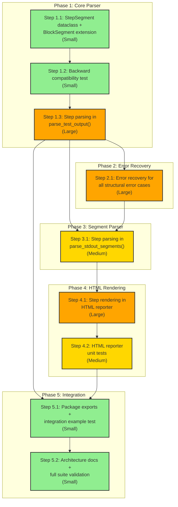

# Steps within Blocks for Structured Logging - Implementation Plan

## Reference
This implementation plan is based on: [architecture/in_development/block-steps/DESIGN.md](DESIGN.md)

## Status Overview
- **Overall Status**: In Progress
- **Current Phase**: Phase 4: HTML Rendering
- **Current Step**: Step 4.2: HTML reporter unit tests
- **Completed Steps**: 6 / 9
- **Last Updated**: 2026-02-19

## How to Use This Plan

### Before Starting: Review Verification Assertions

**IMPORTANT**: Each step includes Verification Assertions that define how to validate successful implementation. Before starting, please:

1. **Review the assertions** for each step
2. **Modify them** if needed to match your environment, testing framework, or requirements
3. **Add more assertions** if you identify additional validation criteria
4. **Ensure they're executable** in your development environment

The implementation agent will run these assertions before marking each step complete, so accurate assertions are critical for smooth progress.

### Starting Implementation

> **Note**: Implementation of this plan should be performed by the **step-implementation agent** located at `.claude/agents/design/implement/step-implementation/AGENT.md`. This specialized agent handles step-by-step implementation with proper validation, testing, and progress tracking.

When you're ready to begin implementation, say:
```
start architecture/in_development/block-steps/PLAN.md
```

Claude will:
1. Read this implementation plan
2. **Ask your commit preference**:
   - **Automatic commits** (recommended): Commits created automatically after each step
   - **Manual review**: You'll be prompted to review changes before each commit
3. Identify the next step to work on (first Not Started step with satisfied dependencies)
4. Update the step status to In Progress
5. Add the started date
6. Begin implementing according to the step's specifications
7. Write tests as specified in the testing requirements
8. **Run all Verification Assertions** for the step
9. **ONLY IF all assertions pass**: Create git commit (automatically or with your review)
10. Mark the step as Completed
11. Update the status overview and proceed to next step

**Assertion Failures**: If any assertion fails, the implementation agent will:
- Report which assertion(s) failed and why
- Attempt to fix the issue
- Re-run the assertions
- Only proceed when all assertions pass

### Resuming Implementation
If you need to resume work later, say:
```
resume architecture/in_development/block-steps/PLAN.md
```

Claude will:
1. Read this implementation plan
2. Check for any In Progress steps and continue with those
3. If no in-progress steps, identify the next Not Started step
4. Continue implementation from where you left off

### Manual Step Selection
To work on a specific step out of order:
```
implement step X.Y from architecture/in_development/block-steps/PLAN.md
```

Claude will check dependencies and warn if prerequisites aren't met.

## Overview

This plan implements hierarchical step support within the existing block-based structured logging system. Test authors will be able to subdivide blocks into named steps (with arbitrary nesting), with clear rules for log attribution, event bubbling, and failure propagation. The feature touches three files: the log parser (`log_parser.py`), its package exports (`__init__.py`), and the HTML reporter (`html_reporter.py`).

The implementation follows the priority order defined in the design document, starting with the core data model and parser, then error recovery, then extending the segment-based parser, then HTML rendering, and finally the integration test and package exports. No new external dependencies are required.

**Key risk**: The feature is entirely contained within existing Python modules using only the standard library. There are no external API calls, no new dependencies, and no performance-critical paths. The primary risk is incorrect parsing logic for edge cases (error recovery), which is mitigated by implementing comprehensive unit tests at each step. The existing test suite provides a strong backward-compatibility baseline.

## Dependency Visualization

This chart shows the dependencies between implementation steps and their relative complexity.



**Legend**:
- Green = Small (50-200 lines, 1-3 files)
- Yellow = Medium (200-500 lines, 3-7 files)
- Orange = Large (500-1000 lines, 7-15 files)
- Arrows show dependencies (prerequisite -> dependent step)

## Implementation Sequence

### Phase 1: Core Parser
**Phase Status**: Completed

Establish the data model and core step-parsing logic in `parse_test_output()`. This is the foundation that all subsequent work depends on.

---

#### Step 1.1: StepSegment dataclass and BlockSegment extension
**Status**: Completed
**Started**: 2026-02-19
**Completed**: 2026-02-19
**PR/Commit**: 3673d32

**Objective**: Add the `StepSegment` dataclass and extend `BlockSegment` with a `steps` field. This establishes the data model without changing any parsing behavior.

**Scope**:
- Create `StepSegment` dataclass in `orchestrator/analysis/log_parser.py`
- Add `steps: list[StepSegment]` field to `BlockSegment`
- Fields on `StepSegment`: `step`, `description`, `status`, `logs`, `features`, `measurements`, `results`, `errors`, `assertions`, `steps`
- NOT included: any parsing logic changes, no export changes yet

**Implementation Details**:
- `StepSegment` is defined before `BlockSegment` so the forward reference in `BlockSegment.steps` resolves naturally
- Default value for `BlockSegment.steps` is `field(default_factory=list)` for backward compatibility
- `StepSegment.status` defaults to `"passed"` per the design
- `StepSegment.steps` allows recursive nesting (list of `StepSegment`)
- The `StepSegment` class should include a docstring explaining its role in the hierarchy

**Verification Assertions**:
> **CRITICAL**: These executable checks validate the step is correctly implemented.
> The implementation agent MUST verify all assertions pass before proceeding to the next step.

```
# Assertion 1: StepSegment can be imported from log_parser
./ci test -- orchestrator/analysis/log_parser_test.py -k "test_empty_input" -x
Expected: Exit code 0. Existing tests still pass (no regression).

# Assertion 2: StepSegment dataclass can be instantiated with defaults
./ci test -- orchestrator/analysis/log_parser_test.py -x
Expected: Exit code 0. All existing log parser tests pass unchanged.

# Assertion 3: BlockSegment has steps field with empty default
./ci shell -c "python3 -c \"from orchestrator.analysis.log_parser import BlockSegment, StepSegment; b = BlockSegment(block='test'); assert b.steps == []; s = StepSegment(step='s1', description='d'); assert s.status == 'passed'; assert s.steps == []; print('OK')\""
Expected: Exit code 0, prints "OK"

# Assertion 4: Type checking passes
./ci check
Expected: Exit code 0, no new type errors
```

**Testing Requirements**:
- No new tests needed -- this is a pure data model addition
- All existing tests must continue to pass (backward compatibility)
- Type checking (mypy) must pass

**Success Criteria**:
- `StepSegment` can be imported and instantiated
- `BlockSegment` instances have a `steps` field defaulting to `[]`
- All existing tests pass without modification
- `./ci check` passes

**Estimated Size**: Small

**Dependencies**: None

**Implementation Notes**:
Added StepSegment dataclass before BlockSegment in log_parser.py with all required fields (step, description, status, logs, features, measurements, results, errors, assertions, steps). Extended BlockSegment with steps field defaulting to empty list. All 78 existing tests pass unchanged. mypy passes cleanly.

---

#### Step 1.2: Backward compatibility baseline test
**Status**: Completed
**Started**: 2026-02-19
**Completed**: 2026-02-19
**PR/Commit**: 932a0fb

**Objective**: Add a dedicated test (`test_backward_compat_no_steps`) that explicitly verifies blocks without steps produce identical output to the current parser, including an empty `steps` list on `BlockSegment`. This locks in the invariant before any parsing changes.

**Scope**:
- Add `TestStepParsing` class (or similar) in `orchestrator/analysis/log_parser_test.py`
- Add `test_backward_compat_no_steps` test case
- Verify that a block with content events but no step events produces `BlockSegment.steps == []`
- Verify all flat lists on the block are populated as before
- NOT included: any step parsing logic

**Implementation Details**:
- The test uses a realistic block with features, measurements, results, and errors
- Asserts that `block.steps == []` (empty list, not missing)
- Asserts all content events are in the block's flat lists as before
- This test is the backward-compatibility anchor for all subsequent parsing changes

**Verification Assertions**:
> **CRITICAL**: These executable checks validate the step is correctly implemented.

```
# Assertion 1: New backward compatibility test passes
./ci test -- orchestrator/analysis/log_parser_test.py -k "test_backward_compat_no_steps" -v
Expected: Exit code 0, test passes

# Assertion 2: All existing tests still pass
./ci test -- orchestrator/analysis/log_parser_test.py -v
Expected: Exit code 0, all tests pass
```

**Testing Requirements**:
- Unit test: `test_backward_compat_no_steps` in `orchestrator/analysis/log_parser_test.py`
- The test should exercise both `parse_test_output()` and verify `.steps == []` on the resulting blocks

**Success Criteria**:
- New test passes
- All existing tests pass
- The test explicitly asserts `block.steps == []`

**Estimated Size**: Small

**Dependencies**: Requires Step 1.1 (StepSegment dataclass must exist)

**Implementation Notes**:
Added TestStepParsing class with test_backward_compat_no_steps. Test covers all four block types (rigging, stimulation, checkpoint, verdict) with features, measurements, results, errors, and plain text. Explicitly asserts block.steps == [] for each block. All 79 tests pass.

---

#### Step 1.3: Step parsing in parse_test_output()
**Status**: Completed
**Started**: 2026-02-19
**Completed**: 2026-02-19
**PR/Commit**: 44f68e6

**Objective**: Extend `parse_test_output()` to handle `step_start`/`step_end` events within blocks. Implement the three-phase top-down parsing approach: (1) split into blocks (existing), (2) split block lines into top-level steps, (3) recurse into each step. Implement bubbling of measurement, result, feature, and error events. Implement step-qualified names for bubbled events. Implement error status propagation.

**Scope**:
- Modify `parse_test_output()` in `orchestrator/analysis/log_parser.py`
- Add internal helper function(s) for step parsing (e.g., `_parse_steps_in_block()`, `_parse_step_content()`)
- Handle `step_start` and `step_end` event types
- Implement event bubbling to block (with step-qualified names)
- Implement error status propagation to parent steps
- Plain text attribution to innermost step
- Events outside steps but inside a block go to block flat lists (existing behavior)
- Add comprehensive unit tests for happy-path step scenarios
- NOT included: error recovery (name mismatch, outside block, unclosed steps, duplicate names) -- those go in Step 2.1

**Implementation Details**:
- After `_flush_block()` produces a `BlockSegment`, a post-processing function scans the block's accumulated lines to extract step structure
- The function maintains a step stack to track nesting
- When a content event is emitted inside a step:
  - It is stored in the innermost step's corresponding list (original name)
  - A shallow copy is bubbled to the block's corresponding list (step-qualified name: `step_a.step_b.original_name`)
  - Error events also propagate `status = "failed"` up the step stack
- Plain text lines inside steps go to the innermost step's `.logs` only (not duplicated to block `.logs`)
- `step_start`/`step_end` sentinel lines in block `.logs` need to be handled -- they are structural markers, not content
- The block's `.logs` field should contain only lines that are outside steps (preserving current behavior for non-step content)
- For this step, mismatched `step_end` names and other structural errors can raise a warning and be handled minimally; full error recovery is Step 2.1

**Key design decisions**:
- Step-qualified names use dot-separated paths: `step_a.step_b.measurement_name`
- Events outside steps retain their original unqualified names (backward compat)
- Error dicts are stored in innermost step `.errors` AND block `.errors`; parent steps only get `status = "failed"`

**Verification Assertions**:
> **CRITICAL**: These executable checks validate the step is correctly implemented.

```
# Assertion 1: Single step in block test
./ci test -- orchestrator/analysis/log_parser_test.py -k "test_single_step_in_block" -v
Expected: Exit code 0, test passes

# Assertion 2: Nested steps test
./ci test -- orchestrator/analysis/log_parser_test.py -k "test_nested_steps" -v
Expected: Exit code 0, test passes

# Assertion 3: Sequential steps test
./ci test -- orchestrator/analysis/log_parser_test.py -k "test_sequential_steps" -v
Expected: Exit code 0, test passes

# Assertion 4: Measurement bubbling test
./ci test -- orchestrator/analysis/log_parser_test.py -k "test_measurement_bubbling" -v
Expected: Exit code 0, test passes

# Assertion 5: Result bubbling test
./ci test -- orchestrator/analysis/log_parser_test.py -k "test_result_bubbling" -v
Expected: Exit code 0, test passes

# Assertion 6: Feature bubbling test
./ci test -- orchestrator/analysis/log_parser_test.py -k "test_feature_bubbling" -v
Expected: Exit code 0, test passes

# Assertion 7: Error attribution test
./ci test -- orchestrator/analysis/log_parser_test.py -k "test_error_attribution" -v
Expected: Exit code 0, test passes

# Assertion 8: Plain text attribution test
./ci test -- orchestrator/analysis/log_parser_test.py -k "test_plain_text_attribution" -v
Expected: Exit code 0, test passes

# Assertion 9: Events outside steps test
./ci test -- orchestrator/analysis/log_parser_test.py -k "test_events_outside_steps" -v
Expected: Exit code 0, test passes

# Assertion 10: Step qualified name format test
./ci test -- orchestrator/analysis/log_parser_test.py -k "test_step_qualified_name_format" -v
Expected: Exit code 0, test passes

# Assertion 11: Backward compatibility still passes
./ci test -- orchestrator/analysis/log_parser_test.py -k "test_backward_compat_no_steps" -v
Expected: Exit code 0, test passes

# Assertion 12: All existing tests still pass
./ci test -- orchestrator/analysis/log_parser_test.py -v
Expected: Exit code 0, all tests pass (no regressions)

# Assertion 13: Type checking passes
./ci check
Expected: Exit code 0
```

**Testing Requirements**:
- Unit tests (all in `orchestrator/analysis/log_parser_test.py`):
  - `test_single_step_in_block`: One step inside a block, verify tree and bubbled events
  - `test_nested_steps`: Three levels of nesting, verify tree structure
  - `test_sequential_steps`: Two sibling steps, verify both in `BlockSegment.steps`
  - `test_measurement_bubbling`: Measurement in nested step, verify original name in step and qualified name in block
  - `test_result_bubbling`: Result in step, verify assertion in step and block
  - `test_feature_bubbling`: Feature in step, verify in step and block
  - `test_error_attribution`: Error in inner step, verify error dict placement and status propagation
  - `test_plain_text_attribution`: Plain text in step, verify in step `.logs` only
  - `test_events_outside_steps`: Events in block but outside steps, verify existing behavior
  - `test_step_qualified_name_format`: Deep nesting, verify `a.b.c.name` format

**Success Criteria**:
- All new step parsing tests pass
- All existing tests pass (backward compatibility)
- Step-qualified names follow the `step_a.step_b.name` format
- Error status propagates up the step stack
- Plain text is attributed to innermost step only

**Estimated Size**: Large

**Dependencies**: Requires Step 1.2

**Implementation Notes**:
Implemented three-phase top-down parsing via _parse_steps_in_block() post-processor. The main parse_test_output() builds blocks as before, tracking raw lines. The post-processor scans raw lines for step_start/step_end, builds the step tree, and re-attributes content events (clearing and rebuilding block flat lists). Bubbling uses copy.copy() for shallow dict copies with qualified names. Error status propagation walks the entire step_stack. All 89 tests pass (79 existing + 10 new).

---

### Phase 2: Error Recovery
**Phase Status**: Completed

Implement the valid-prefix-plus-undefined-remainder recovery strategy for all structural error cases. This is essential for parser robustness.

---

#### Step 2.1: Error recovery for all structural error cases
**Status**: Completed
**Started**: 2026-02-19
**Completed**: 2026-02-19
**PR/Commit**: 39b97e9
**PR/Commit**:

**Objective**: Implement the valid-prefix-plus-undefined-remainder error recovery strategy for all four structural error cases identified in the design: (1) `step_end` name mismatch, (2) `step_start` outside any block, (3) `block_end` while steps are still open, (4) duplicate step names within the same scope. Implement the "warning" status and the "undefined" step/block creation. Implement the rule that "failed" takes precedence over "warning".

**Scope**:
- Modify step-parsing logic in `orchestrator/analysis/log_parser.py`
- Create undefined steps (`step == "undefined"`, `status == "warning"`) for error recovery
- Create undefined blocks (`block == "undefined"`) for step events outside blocks
- Add parser warnings to `ParsedOutput.warnings` for each structural error
- Implement the precedence rule: `"failed"` > `"warning"`
- Add unit tests for all four error cases plus the precedence test
- NOT included: HTML rendering of warning-status steps (that is Step 4.1)

**Implementation Details**:
- **Case 1: step_end name mismatch**: When `step_end` name does not match innermost open step, keep valid prefix (everything before the mismatch), put the mismatched `step_end` line and all subsequent lines in the current scope into an undefined step with `status = "warning"`
- **Case 2: step_start outside block**: When a `step_start` appears outside any block, collect it and subsequent lines until the next `block_start` (or end of output) into an undefined block with warning state
- **Case 3: block_end with unclosed steps**: When `block_end` is encountered with open steps, close properly closed steps as valid prefix, put unclosed content into an undefined step with `status = "warning"` within the block
- **Case 4: Duplicate step names**: When a `step_start` uses a name already seen in the same scope, keep the first occurrence, put the duplicate and all subsequent lines into an undefined step with `status = "warning"`
- **Precedence**: If a step has both errors (content `error` event) and a structural parse error, set `status = "failed"` (not `"warning"`). The parser warning is still recorded.

**Verification Assertions**:
> **CRITICAL**: These executable checks validate the step is correctly implemented.

```
# Assertion 1: step_end name mismatch error recovery
./ci test -- orchestrator/analysis/log_parser_test.py -k "test_step_end_name_mismatch" -v
Expected: Exit code 0, test passes

# Assertion 2: step_start outside block
./ci test -- orchestrator/analysis/log_parser_test.py -k "test_step_start_outside_block" -v
Expected: Exit code 0, test passes

# Assertion 3: block_end with unclosed steps
./ci test -- orchestrator/analysis/log_parser_test.py -k "test_block_end_unclosed_steps" -v
Expected: Exit code 0, test passes

# Assertion 4: Duplicate step names
./ci test -- orchestrator/analysis/log_parser_test.py -k "test_duplicate_step_names" -v
Expected: Exit code 0, test passes

# Assertion 5: Failed takes precedence over warning
./ci test -- orchestrator/analysis/log_parser_test.py -k "test_failed_takes_precedence_over_warning" -v
Expected: Exit code 0, test passes

# Assertion 6: All existing tests still pass
./ci test -- orchestrator/analysis/log_parser_test.py -v
Expected: Exit code 0, all tests pass (no regressions)

# Assertion 7: Type checking passes
./ci check
Expected: Exit code 0
```

**Testing Requirements**:
- Unit tests (all in `orchestrator/analysis/log_parser_test.py`):
  - `test_step_end_name_mismatch`: Verify valid prefix kept, undefined step created with warning, parser warning recorded
  - `test_step_start_outside_block`: Verify undefined block created with warning state
  - `test_block_end_unclosed_steps`: Verify valid prefix kept, undefined step in block, block still closes
  - `test_duplicate_step_names`: Verify first step parsed, remainder in undefined step with warning
  - `test_failed_takes_precedence_over_warning`: Verify status is "failed" when both error and structural issue present

**Success Criteria**:
- All four error cases produce correct recovery behavior
- Parser never crashes on malformed input
- Warnings are recorded in `ParsedOutput.warnings`
- "failed" takes precedence over "warning"
- All existing tests pass

**Estimated Size**: Large

**Dependencies**: Requires Step 1.3

**Implementation Notes**:
Implemented all four error recovery cases. Refactored _parse_steps_in_block with helper functions (_dispatch_content_event, _dispatch_block_content, _create_undefined_step) and a collecting_remainder mode for block-level errors. Case 2 (step_start outside block) handled in parse_test_output. All 94 tests pass.

---

### Phase 3: Segment Parser Extension
**Phase Status**: Not Started

Extend the segment-based parser (`parse_stdout_segments()`) to build step trees within `BlockSegment` objects. This parser is used by the HTML reporter.

---

#### Step 3.1: Step parsing in parse_stdout_segments()
**Status**: Completed
**Started**: 2026-02-19
**Completed**: 2026-02-19
**PR/Commit**: 2adfe40

**Objective**: Extend `parse_stdout_segments()` to handle `step_start`/`step_end` events and build the step tree within `BlockSegment` objects. This function follows the same patterns as `parse_test_output()`, applied to the segment-based parser used by the HTML reporter. Include all error recovery behavior.

**Scope**:
- Modify `parse_stdout_segments()` in `orchestrator/analysis/log_parser.py`
- Reuse the step-parsing helper functions from Step 1.3 (refactor if needed for shared use between both parsers)
- Handle step events, bubbling, error propagation, and all error recovery cases
- Add the `test_parse_stdout_segments_with_steps` test
- NOT included: HTML rendering changes

**Implementation Details**:
- The segment-based parser produces `BlockSegment` objects with the same structure as `parse_test_output()`
- The step parsing logic from Step 1.3 and error recovery from Step 2.1 should ideally be factored into shared helper functions that both parsers can call
- If the two parsers handle content events slightly differently (e.g., `parse_stdout_segments` uses `_normalize_assertion()` for result events and stores in `.assertions`, while `parse_test_output` stores in `.results`), the step parsing helper must account for this
- The key insight is that step parsing is a post-processing step on a block's accumulated lines, so the same function can work for both parsers

**Verification Assertions**:
> **CRITICAL**: These executable checks validate the step is correctly implemented.

```
# Assertion 1: parse_stdout_segments populates steps
./ci test -- orchestrator/analysis/log_parser_test.py -k "test_parse_stdout_segments_with_steps" -v
Expected: Exit code 0, test passes

# Assertion 2: All existing parse_stdout_segments tests still pass
./ci test -- orchestrator/analysis/log_parser_test.py -k "TestParseStdoutSegments" -v
Expected: Exit code 0, all tests pass

# Assertion 3: All log parser tests pass
./ci test -- orchestrator/analysis/log_parser_test.py -v
Expected: Exit code 0, all tests pass

# Assertion 4: Type checking passes
./ci check
Expected: Exit code 0
```

**Testing Requirements**:
- Unit test: `test_parse_stdout_segments_with_steps` in `orchestrator/analysis/log_parser_test.py`
  - Construct stdout with blocks containing steps
  - Verify `BlockSegment.steps` is populated correctly
  - Verify bubbling and step-qualified names work
  - Verify error recovery works in the segment parser
- All existing `TestParseStdoutSegments` tests must continue to pass

**Success Criteria**:
- `parse_stdout_segments()` produces `BlockSegment` objects with populated `.steps`
- Bubbling and error recovery work identically to `parse_test_output()`
- All existing segment parser tests pass

**Estimated Size**: Medium

**Dependencies**: Requires Step 1.3 and Step 2.1

**Implementation Notes**:
Extended parse_stdout_segments() with raw line tracking and _parse_steps_in_block() post-processing. Added use_assertions parameter to _parse_steps_in_block() so the same helper works for both parsers: parse_test_output uses .results (with block tags), while parse_stdout_segments uses .assertions (via _normalize_assertion, no block tags, preserving action/unit fields). Added step_start-outside-block error recovery. All 97 parser tests pass, 732 total tests pass, mypy clean.

---

### Phase 3: Segment Parser Extension
**Phase Status**: Completed

---

### Phase 4: HTML Rendering
**Phase Status**: Not Started

Extend the HTML reporter to render step trees as nested collapsible sections. This delivers the visible value of the feature to test result readers.

---

#### Step 4.1: Step rendering in HTML reporter
**Status**: Completed
**Started**: 2026-02-19
**Completed**: 2026-02-19
**PR/Commit**: 82382f8

**Objective**: Extend `_render_block_segment()` to render step trees. Add a new `_render_step_segment()` function with collapsible `<details>` pattern, status badges, ancestor expansion logic, and warning state rendering. Add CSS for step styling.

**Scope**:
- Modify `orchestrator/reporting/html_reporter.py`
- Import `StepSegment` from `orchestrator.analysis.log_parser`
- Add `_render_step_segment()` function
- Extend `_render_block_segment()` to call `_render_step_segment()` for each top-level step
- Add CSS classes for step styling (step status badges, step header, step nesting)
- Rendering rules: passed steps collapsed, failed/warning steps expanded, ancestor expansion for failed sub-steps
- Step header shows status badge + description + step name (muted)
- Step body contains features, measurements table, assertions, errors, raw logs (collapsed), and nested sub-steps
- NOT included: tests (those are Step 4.2)

**Implementation Details**:
- `_render_step_segment()` follows the same rendering patterns as `_render_block_segment()` (features, measurements table, assertions, errors, logs)
- Uses `<details>/<summary>` for collapsibility
- `open` attribute is set on `<details>` when `status != "passed"` (i.e., failed or warning)
- Ancestor expansion: if any sub-step is failed/warning, this step's `<details>` must also be `open`. This can be determined by checking if any descendant has `status != "passed"` -- a recursive helper or a pre-pass that computes "should_expand" is needed
- Step status badge colors: "passed" = green (`#90EE90`), "failed" = pink/red (`#FFB6C1`), "warning" = amber/yellow (`#FFFFAD`)
- CSS: `.step-segment` for the step container, indented inside parent; `.step-header` for the summary line; `.step-status-badge` for the status indicator
- Step name displayed in muted style (e.g., `<span class="step-name">step_name</span>`)
- Source link support for events within steps (same pattern as blocks)
- Nested sub-steps rendered recursively inside the parent step's body

**Verification Assertions**:
> **CRITICAL**: These executable checks validate the step is correctly implemented.

```
# Assertion 1: HTML reporter can render a block with steps without error
./ci shell -c "python3 -c \"
from orchestrator.analysis.log_parser import BlockSegment, StepSegment
from orchestrator.reporting.html_reporter import _render_block_segment
step = StepSegment(step='s1', description='Test step', status='passed')
block = BlockSegment(block='stimulation', steps=[step])
html = _render_block_segment(block)
assert '<details' in html
assert 'Test step' in html
print('OK')
\""
Expected: Exit code 0, prints "OK"

# Assertion 2: Failed step renders with open attribute
./ci shell -c "python3 -c \"
from orchestrator.analysis.log_parser import BlockSegment, StepSegment
from orchestrator.reporting.html_reporter import _render_block_segment
step = StepSegment(step='s1', description='Failing step', status='failed')
block = BlockSegment(block='stimulation', steps=[step])
html = _render_block_segment(block)
assert 'open' in html
print('OK')
\""
Expected: Exit code 0, prints "OK"

# Assertion 3: Block without steps renders unchanged
./ci shell -c "python3 -c \"
from orchestrator.analysis.log_parser import BlockSegment
from orchestrator.reporting.html_reporter import _render_block_segment
block = BlockSegment(block='rigging', features=[{'name': 'auth'}])
html = _render_block_segment(block)
assert 'auth' in html
assert 'step' not in html.lower() or 'step' in html  # no step elements for non-step blocks
print('OK')
\""
Expected: Exit code 0, prints "OK"

# Assertion 4: Type checking passes
./ci check
Expected: Exit code 0

# Assertion 5: All existing tests pass
./ci test
Expected: Exit code 0
```

**Testing Requirements**:
- Manual testing: generate an HTML report with step data and visually verify layout
- Automated tests are covered in Step 4.2

**Success Criteria**:
- Steps render as nested collapsible `<details>` elements
- Passed steps are collapsed; failed/warning steps are expanded
- Ancestor expansion works (path to failed sub-step is all expanded)
- Step header shows status badge, description, and step name
- Step body shows features, measurements, assertions, errors, logs
- Block without steps renders identically to current behavior

**Estimated Size**: Large

**Dependencies**: Requires Step 3.1

**Implementation Notes**:
Added _render_step_segment() with recursive rendering, _step_should_expand() for ancestor expansion, CSS for step styling, and integrated step rendering into _render_block_segment(). Steps render as nested collapsible <details> elements with status badges. Passed steps collapsed, failed/warning expanded. All 732 tests pass, mypy clean.

---

#### Step 4.2: HTML reporter unit tests
**Status**: In Progress
**Started**: 2026-02-19
**Completed**:
**PR/Commit**:

**Objective**: Create a dedicated HTML reporter test file for step rendering. Test all rendering scenarios: passed/failed/warning steps, ancestor expansion, step header content, measurements/errors in step body, nested steps, and backward compatibility (block without steps).

**Scope**:
- Create new test file `tests/test_html_reporter_steps.py`
- Add test cases per the design document's testing strategy for HTML rendering
- Tests construct `BlockSegment` objects with `StepSegment` trees and call `_render_block_segment()` directly
- Verify HTML output contains expected elements, attributes, and structure
- NOT included: end-to-end report generation tests (those use actual stdout parsing)

**Implementation Details**:
- Tests import `_render_block_segment` and `_render_step_segment` (or just `_render_block_segment` since it calls the step renderer)
- Tests construct `StepSegment` and `BlockSegment` objects directly (no parsing needed)
- Use simple string assertions (`in`, `not in`) or basic HTML parsing to verify structure
- Test cases from the design:
  - `test_step_renders_as_details`: Passed step produces `<details>` without `open`
  - `test_failed_step_expanded`: Failed step has `<details open`
  - `test_warning_step_expanded`: Warning step has `<details open`
  - `test_ancestor_expansion`: Failed step 3 levels deep, all ancestors expanded
  - `test_step_header_content`: Summary contains badge, description, step name
  - `test_step_body_measurements`: Measurements table inside step body
  - `test_step_body_errors`: Error div inside step body
  - `test_nested_step_indentation`: Sub-steps inside parent body (DOM nesting)
  - `test_block_without_steps`: Unchanged rendering

**Verification Assertions**:
> **CRITICAL**: These executable checks validate the step is correctly implemented.

```
# Assertion 1: All HTML reporter step tests pass
./ci test -- tests/test_html_reporter_steps.py -v
Expected: Exit code 0, all 9 tests pass

# Assertion 2: All existing tests still pass
./ci test
Expected: Exit code 0

# Assertion 3: Type checking passes
./ci check
Expected: Exit code 0
```

**Testing Requirements**:
- 9 unit tests in `tests/test_html_reporter_steps.py` as listed above
- Each test directly constructs data model objects (no parsing)
- Tests verify HTML structure through string matching

**Success Criteria**:
- All 9 HTML reporter step tests pass
- Tests cover passed, failed, and warning states
- Tests verify ancestor expansion behavior
- Tests verify step content rendering (measurements, errors, etc.)
- Block without steps test confirms backward compatibility

**Estimated Size**: Medium

**Dependencies**: Requires Step 4.1

**Implementation Notes**:
[Filled in during implementation]

---

### Phase 5: Integration and Finalization
**Phase Status**: Not Started

Create the integration example test, update package exports, validate the full test suite, and update architecture documentation.

---

#### Step 5.1: Package exports and integration example test
**Status**: Not Started
**Started**:
**Completed**:
**PR/Commit**:

**Objective**: Add `StepSegment` to the `orchestrator/analysis/__init__.py` exports. Create the `examples/ecommerce/order_steps_test.py` integration example that demonstrates steps within blocks in an end-to-end scenario. Add the new test to the examples BUILD.bazel.

**Scope**:
- Modify `orchestrator/analysis/__init__.py`: add `StepSegment` to imports and `__all__`
- Create `examples/ecommerce/order_steps_test.py`: example test demonstrating nested steps within a stimulation block
- Modify `examples/ecommerce/BUILD.bazel`: add `py_test` and `test_set_test` for the new example
- NOT included: architecture doc updates (Step 5.2)

**Implementation Details**:
- `order_steps_test.py` should demonstrate:
  - Steps within a stimulation block (e.g., `create_order` with sub-steps `validate_inventory`, `process_payment`, `send_confirmation`)
  - Measurements within steps (bubbled to block with qualified names)
  - Result assertions within steps
  - Nested steps (at least 2 levels deep)
  - The test uses the same `tst()` helper pattern as existing example tests
- The BUILD.bazel additions follow the same pattern as existing `order_placement_wrapped` (py_test + test_set_test)
- The test should be added to an appropriate test set (e.g., `checkout_flow_tests`)

**Verification Assertions**:
> **CRITICAL**: These executable checks validate the step is correctly implemented.

```
# Assertion 1: StepSegment is importable from orchestrator.analysis
./ci shell -c "python3 -c \"from orchestrator.analysis import StepSegment; print('OK')\""
Expected: Exit code 0, prints "OK"

# Assertion 2: Example test runs successfully
./ci test -- //ecommerce:order_steps_raw_test
Expected: Exit code 0, test passes

# Assertion 3: Example test stdout contains step events
./ci shell -c "python3 examples/ecommerce/order_steps_test.py 2>&1 | grep step_start"
Expected: Exit code 0, at least one step_start line appears

# Assertion 4: All existing tests pass
./ci test
Expected: Exit code 0

# Assertion 5: Type checking passes
./ci check
Expected: Exit code 0
```

**Testing Requirements**:
- The example test serves as an integration test: it emits step events, and the parser can parse them, and the HTML reporter can render them
- The example test itself passes (exit code 0)
- Bazel can build and run the test target

**Success Criteria**:
- `StepSegment` is importable from `orchestrator.analysis`
- Example test runs and produces structured output with step events
- Bazel test target builds and passes
- All existing tests pass

**Estimated Size**: Small

**Dependencies**: Requires Step 1.3 and Step 4.2

**Implementation Notes**:
[Filled in during implementation]

---

#### Step 5.2: Architecture documentation update and full validation
**Status**: Not Started
**Started**:
**Completed**:
**PR/Commit**:

**Objective**: Update the architecture documentation in `architecture/current/` to reflect the new step feature. Run the full test suite (`./ci test`, `./ci check`, `./ci build`) to validate everything works end-to-end.

**Scope**:
- Update `architecture/current/components/log-parser.md` to document `StepSegment` and step parsing
- Update `architecture/current/components/html-reporter.md` to document step rendering
- Update `architecture/current/flows/report-generation.md` to mention step tree rendering
- Update `architecture/current/README.md` Git Sync section with current commit
- Run full validation: `./ci build`, `./ci test`, `./ci check`
- NOT included: no code changes

**Implementation Details**:
- Log parser component doc should describe:
  - The `StepSegment` dataclass and its fields
  - Step parsing behavior in both `parse_test_output()` and `parse_stdout_segments()`
  - Bubbling and attribution rules
  - Error recovery strategy
- HTML reporter component doc should describe:
  - Step rendering as nested collapsible `<details>` elements
  - Status-dependent expansion behavior
  - Step header and body layout
- Report generation flow doc should mention:
  - Step trees are parsed from stdout and rendered as part of block segments

**Verification Assertions**:
> **CRITICAL**: These executable checks validate the step is correctly implemented.

```
# Assertion 1: Full build passes
./ci build
Expected: Exit code 0

# Assertion 2: Full test suite passes
./ci test
Expected: Exit code 0

# Assertion 3: Type checking passes
./ci check
Expected: Exit code 0

# Assertion 4: Architecture docs exist and are updated
ls architecture/current/components/log-parser.md architecture/current/components/html-reporter.md architecture/current/flows/report-generation.md
Expected: Exit code 0, all files exist
```

**Testing Requirements**:
- Full suite validation: `./ci build`, `./ci test`, `./ci check`
- Architecture docs are reviewed for accuracy

**Success Criteria**:
- All builds, tests, and checks pass
- Architecture docs accurately describe the new step feature
- Git Sync section in README.md is updated

**Estimated Size**: Small

**Dependencies**: Requires Step 5.1

**Implementation Notes**:
[Filled in during implementation]

---

## Testing Strategy

### Overall Approach
Tests are written incrementally alongside each implementation step. The strategy prioritizes unit tests (highest priority), followed by integration validation, deferring end-to-end tests until behaviors are validated.

### Test Pyramid
1. **Unit tests (Steps 1.2, 1.3, 2.1, 3.1, 4.2)**: Test parsing logic and rendering in isolation. Constructed inputs, verified outputs. These form the bulk of the testing.
2. **Integration example (Step 5.1)**: A realistic example test that exercises the full pipeline: emit structured events -> parse -> render HTML. Validates that all components work together.
3. **Full suite validation (Step 5.2)**: Run `./ci build`, `./ci test`, `./ci check` to confirm no regressions across the entire project.

### Backward Compatibility
- Step 1.2 establishes the backward compatibility baseline
- Every subsequent step asserts all existing tests pass
- `BlockSegment.steps` defaults to `[]`, so all existing code continues to work

### Test File Locations
- Parser tests: `orchestrator/analysis/log_parser_test.py` (extending existing file)
- HTML reporter tests: `tests/test_html_reporter_steps.py` (new file)
- Example integration test: `examples/ecommerce/order_steps_test.py` (new file)

## Rollout Considerations
- **Feature flags**: Not applicable -- the feature is additive and backward compatible
- **Backward compatibility**: `BlockSegment.steps` defaults to `[]`; all existing consumers see the same data in block flat lists. No API changes to public functions.
- **Deployment sequence**: The feature can be deployed all at once since it is backward compatible. No staged rollout needed.
- **Rollback plan**: Revert the commits. No data migration or state changes are involved.

## Implementation Log
Track major milestones and decisions during implementation:

### 2026-02-19
- Implementation plan created
- Step 1.1 completed: StepSegment dataclass and BlockSegment.steps field (3673d32)
- Step 1.2 completed: Backward compatibility baseline test (932a0fb)
- Step 1.3 completed: Step parsing in parse_test_output() (44f68e6)
- Step 2.1 completed: Error recovery for all structural error cases (39b97e9)
- Step 3.1 completed: Step parsing in parse_stdout_segments() (2adfe40)
- Step 4.1 completed: Step rendering in HTML reporter (82382f8)

## Future Enhancements
Features from the design document that are deferred or out of scope for this implementation plan:
- **Step timing**: Adding duration tracking per step (start/end timestamps)
- **Step filtering in HTML**: UI controls to filter/search steps by name or status
- **Step-level judgement**: Enabling judgement targets to reference individual step measurements by qualified name
- **Step export in JSON reports**: Including the step tree in the JSON report structure (currently only in HTML via stdout parsing)
