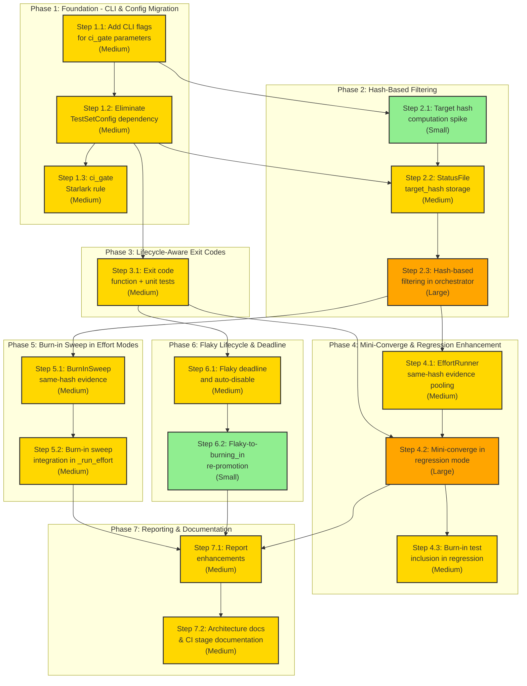

# Execution Modes and CI Stage Integration Implementation Plan

## Reference
This implementation plan is based on: [architecture/in_development/execution-modes-ci-stages/DESIGN.md](DESIGN.md)

## Status Overview
- **Overall Status**: In Progress
- **Current Phase**: Phase 7: Reporting & Documentation
- **Current Step**: Step 7.1: Report Enhancements
- **Completed Steps**: 14 / 16
- **Last Updated**: 2026-02-24

## How to Use This Plan

### Before Starting: Review Verification Assertions

**IMPORTANT**: Each step includes Verification Assertions that define how to validate successful implementation. Before starting, please:

1. **Review the assertions** for each step
2. **Modify them** if needed to match your environment, testing framework, or requirements
3. **Add more assertions** if you identify additional validation criteria
4. **Ensure they're executable** in your development environment

The implementation agent will run these assertions before marking each step complete, so accurate assertions are critical for smooth progress.

### Starting Implementation

> **Note**: Implementation of this plan should be performed by the **step-implementation agent** located at `.claude/agents/design/implement/step-implementation/AGENT.md`. This specialized agent handles step-by-step implementation with proper validation, testing, and progress tracking.

When you're ready to begin implementation, say:
```
start architecture/in_development/execution-modes-ci-stages/PLAN.md
```

Claude will:
1. Read this implementation plan
2. **Ask your commit preference**:
   - **Automatic commits** (recommended): Commits created automatically after each step
   - **Manual review**: You'll be prompted to review changes before each commit
3. Identify the next step to work on (first Not Started step with satisfied dependencies)
4. Update the step status to In Progress
5. Add the started date
6. Begin implementing according to the step's specifications
7. Write tests as specified in the testing requirements
8. **Run all Verification Assertions** for the step
9. **ONLY IF all assertions pass**: Create git commit (automatically or with your review)
10. Mark the step as Completed
11. Update the status overview and proceed to next step

**Note**: Automatic commits provide better safety and history tracking. Manual review is useful if you want to inspect changes before committing.

**Assertion Failures**: If any assertion fails, the implementation agent will:
- Report which assertion(s) failed and why
- Attempt to fix the issue
- Re-run the assertions
- Only proceed when all assertions pass

### Resuming Implementation
If you need to resume work later, say:
```
resume architecture/in_development/execution-modes-ci-stages/PLAN.md
```

Claude will:
1. Read this implementation plan
2. Check for any In Progress steps and continue with those
3. If no in-progress steps, identify the next Not Started step
4. Continue implementation from where you left off

### Manual Step Selection
To work on a specific step out of order:
```
implement step X.Y from architecture/in_development/execution-modes-ci-stages/PLAN.md
```

Claude will check dependencies and warn if prerequisites aren't met.

## Overview

This plan implements the execution modes and CI stage integration design, which introduces:

1. **`ci_gate` Starlark rule** -- Bundles a `test_set` with execution policy and statistical/lifecycle parameters into a single runnable Bazel target. Each CI stage becomes `bazel run //ci:{stage}_tests`.
2. **`.test_set_config` elimination** -- All configuration moves from the JSON config file to `ci_gate` target attributes, passed as CLI flags to the orchestrator.
3. **Hash-based test filtering** -- Target hashes computed via `bazel aquery` enable skipping unchanged tests and pooling SPRT evidence across sessions with matching hashes.
4. **Mini-converge in regression mode** -- Budget-capped SPRT reruns on failures to discriminate flakes from real regressions at PR gate.
5. **Lifecycle-aware exit codes** -- Tests in `flaky`/`new`/`burning_in` state never block PR/merge; only `stable` test failures block.
6. **Burn-in integration** -- New/burning_in tests included in regression selection; burn-in sweep added after SPRT rerun loop in converge/max modes.
7. **Flaky deadline with auto-disable** -- Configurable deadline after which unresolved flaky tests auto-disable.

The implementation follows a risk-driven ordering: foundational changes first (CLI parameter migration, config elimination), then hash-based filtering (risky external dependency on `bazel aquery`), then the behavioral changes that build on the foundation.

## Code Style & Conventions

- **Language**: Python 3.12 for orchestrator, Starlark for Bazel rules
- **Testing**: pytest for unit tests, Bazel test for integration tests
- **Type checking**: mypy (strict)
- **Imports**: `from __future__ import annotations` at top of every Python file
- **Docstrings**: Google-style docstrings for all public functions and classes
- **Data classes**: Use `@dataclass` for structured data types
- **Lazy imports**: Performance-sensitive imports (effort, regression, e-values) done inside functions, not at module level
- **Status file operations**: Always call `sf.save()` after mutations to ensure crash recovery
- **All commands run via `./ci`**: Never run `pytest`, `bazel`, or `mypy` directly

## Boundaries

### Always (no approval needed)
- Update architecture docs in `architecture/current/` after code changes
- Run all tests via `./ci test` before marking a step complete
- Run type checks via `./ci check` before marking a step complete
- Follow existing code patterns for new code (lazy imports, dataclasses, etc.)

### Ask First (requires human approval)
- Changing the status file JSON format (backward compatibility concern)
- Removing public API functions or changing their signatures
- Modifying Bazel rule behavior that affects existing users
- Changes to the `ci` script itself

### Never
- Run commands directly outside the Docker container (always use `./ci`)
- Push to remote without explicit user request
- Modify `.gitignore` or CI configuration without asking
- Commit secrets or credentials

## Known Pitfalls

1. **`bazel aquery` cold cache**: On a cold Bazel cache, `bazel aquery` may trigger full analysis, taking minutes instead of seconds. The hash computation step must handle this gracefully (timeouts, fallback).
2. **Session-only SPRT**: The current `EffortRunner` uses only session-local data for SPRT. The design requires switching to same-hash evidence pooling. This is a behavioral change that must be carefully tested.
3. **Config migration backward compatibility**: Removing `TestSetConfig` breaks any existing `.test_set_config` files. The migration must be clean: old config files should be ignored (not cause errors), and all parameters must have CLI flag equivalents.
4. **Status file format changes**: Adding `target_hash` to the status file must be backward-compatible with existing status files that lack this field.
5. **Starlark testing limitations**: Starlark rules cannot be unit-tested with pytest. They must be tested via Bazel integration tests (building targets and inspecting outputs).

## Dependency Visualization

This chart shows the dependencies between implementation steps and their relative complexity.



**Legend**:
- Green = Small (50-200 lines, 1-3 files)
- Yellow = Medium (200-500 lines, 3-7 files)
- Orange = Large (500-1000 lines, 7-15 files)
- Arrows show dependencies (prerequisite -> dependent step)

## Implementation Sequence

### Phase 1: Foundation -- CLI & Config Migration
**Phase Status**: Completed

This phase migrates all execution parameters from `TestSetConfig` / `.test_set_config` to CLI flags, then creates the `ci_gate` Starlark rule that generates runner scripts with baked-in flags. This is the foundation for all subsequent work.

---

#### Step 1.1: Add CLI Flags for ci_gate Parameters
**Status**: Completed
**Started**: 2026-02-23
**Completed**: 2026-02-23
**PR/Commit**: 03be64f

**Objective**: Add all new CLI flags to the orchestrator's argument parser so that the `ci_gate` runner script can pass execution policy and statistical/lifecycle parameters via the command line.

**Scope**:
- Modify `orchestrator/main.py` `parse_args()` to add the following flags:
  - `--max-reruns` (int, default 100)
  - `--max-failures` (int, optional)
  - `--max-parallel` (int, optional)
  - `--status-file` (Path, optional)
  - `--max-test-percentage` (float, default 0.10)
  - `--max-hops` (int, default 2)
  - `--skip-unchanged` / `--no-skip-unchanged` (bool, default True)
  - `--min-reliability` (float, default 0.99)
  - `--statistical-significance` (float, default 0.95)
  - `--flaky-deadline-days` (int, default 14)
- Add a helper function `_resolve_params(args, config)` that merges CLI flags with config file values (CLI takes precedence), returning a unified params namespace/dict. This enables backward compatibility during the transition period (Step 1.2 will remove config).
- Update existing tests in `orchestrator/main_test.py` to verify new flags parse correctly.
- Does NOT change any execution behavior yet -- only argument parsing and parameter resolution.

**Implementation Details**:
- Use `argparse` defaults that match the existing `DEFAULT_CONFIG` values so behavior is unchanged when no flags are passed.
- `--skip-unchanged` uses `store_true` / `--no-skip-unchanged` uses `store_false` with `dest="skip_unchanged"`.
- `--status-file` as a direct CLI flag replaces reading `status_file` from `.test_set_config`.
- The `_resolve_params` function creates a simple namespace with all parameters, checking CLI args first, then falling back to config values. This is a transitional step.

**Verification Assertions**:
```
# Assertion 1: New CLI flags are recognized and parse without error
./ci test -k "test_parse" orchestrator/main_test.py
Expected: Exit code 0, all parse_args tests pass

# Assertion 2: Default values match existing DEFAULT_CONFIG
./ci shell -c "cd /workspace && python -c \"
from orchestrator.main import parse_args
args = parse_args(['--manifest', 'dummy.json'])
assert args.max_reruns == 100, f'max_reruns={args.max_reruns}'
assert args.min_reliability == 0.99, f'min_reliability={args.min_reliability}'
assert args.statistical_significance == 0.95
assert args.flaky_deadline_days == 14
assert args.skip_unchanged == True
print('All defaults OK')
\""
Expected: Exit code 0, prints "All defaults OK"

# Assertion 3: CLI flags override defaults
./ci shell -c "cd /workspace && python -c \"
from orchestrator.main import parse_args
args = parse_args(['--manifest', 'dummy.json', '--max-reruns', '5', '--min-reliability', '0.999', '--no-skip-unchanged'])
assert args.max_reruns == 5
assert args.min_reliability == 0.999
assert args.skip_unchanged == False
print('Overrides OK')
\""
Expected: Exit code 0, prints "Overrides OK"

# Assertion 4: Full test suite still passes
./ci test
Expected: Exit code 0, all tests pass

# Assertion 5: Type checks pass
./ci check
Expected: Exit code 0, no type errors
```

**Testing Requirements**:
- Unit tests for `parse_args` with new flags (defaults, overrides, combinations)
- Unit test for `_resolve_params` merging CLI + config values
- Verify existing tests still pass unchanged

**Success Criteria**:
- All new CLI flags are accepted by the argument parser
- Default values match existing `DEFAULT_CONFIG`
- CLI values override config file values when both are present
- All existing tests pass without modification

**Estimated Size**: Medium

**Dependencies**: None

**Implementation Notes**:
- Added 10 new CLI flags to `parse_args()` matching DEFAULT_CONFIG values
- `--skip-unchanged` / `--no-skip-unchanged` uses `store_true`/`store_false` with `dest="skip_unchanged"`
- `_resolve_params()` merges CLI with config using default-detection heuristic (CLI non-default value wins)
- 31 new tests added (26 for parse_args, 5 for _resolve_params)
- All 864 existing tests pass unchanged; type checks pass

---

#### Step 1.2: Eliminate TestSetConfig Dependency from Orchestrator
**Status**: Completed
**Started**: 2026-02-23
**Completed**: 2026-02-23
**PR/Commit**: 87751f5

**Objective**: Remove the orchestrator's dependency on `TestSetConfig` and `.test_set_config` files. All parameters are now read from CLI flags (which will be set by `ci_gate` runner scripts). The `StatusFile` class is updated to accept statistical parameters directly instead of delegating to `TestSetConfig`.

**Scope**:
- Modify `orchestrator/lifecycle/status.py`:
  - Remove `config_path` parameter from `StatusFile.__init__`
  - Remove `_config` attribute and all property delegations to `TestSetConfig`
  - Add `min_reliability` and `statistical_significance` as constructor parameters with defaults
  - Store them directly as instance attributes
  - Remove all `max_*` property delegations (those are orchestrator concerns, not status file concerns)
- Modify `orchestrator/main.py`:
  - Replace all `config.xxx` references with `args.xxx` (CLI parameters)
  - Remove `TestSetConfig` import and instantiation
  - Remove `--config-file` flag
  - Update `StatusFile` construction to pass `min_reliability` and `statistical_significance` from CLI args
  - Update `_run_orchestrator`, `_run_regression`, `_run_effort` to use `args` directly
- Modify `orchestrator/execution/effort.py`:
  - `EffortRunner` reads `min_reliability` and `statistical_significance` from its `StatusFile` (unchanged interface, but StatusFile now stores these directly)
- Update `orchestrator/lifecycle/config.py`: Keep the file but mark `TestSetConfig` as deprecated (or remove if no other consumers)
- Update all tests in `orchestrator/main_test.py`, `orchestrator/lifecycle/status_test.py`, `orchestrator/lifecycle/config_test.py`
- Does NOT change `rules/test_set.bzl` runner script yet (that comes in Step 1.3)

**Implementation Details**:
- The key change is that `StatusFile` no longer needs `TestSetConfig`. Instead, `min_reliability` and `statistical_significance` are passed directly.
- `_run_orchestrator` currently reads `config = TestSetConfig(args.config_file)` and then uses `config.status_file`, `config.max_parallel`, etc. All of these become `args.status_file`, `args.max_parallel`, etc.
- Backward compatibility: The `--config-file` flag is removed. If users have `.test_set_config` files, they are simply ignored. No error is raised for their presence -- they just have no effect.
- Pitfall: `burnin.py` reads `sf.min_reliability` and `sf.statistical_significance` via `StatusFile` properties that delegate to `TestSetConfig`. After this step, those properties read from StatusFile's own attributes.

**Verification Assertions**:
```
# Assertion 1: StatusFile can be created without config_path
./ci shell -c "cd /workspace && python -c \"
from orchestrator.lifecycle.status import StatusFile
import tempfile, os
with tempfile.TemporaryDirectory() as d:
    sf = StatusFile(os.path.join(d, 'status'), min_reliability=0.999, statistical_significance=0.90)
    assert sf.min_reliability == 0.999
    assert sf.statistical_significance == 0.90
    print('StatusFile OK')
\""
Expected: Exit code 0, prints "StatusFile OK"

# Assertion 2: StatusFile defaults work without explicit params
./ci shell -c "cd /workspace && python -c \"
from orchestrator.lifecycle.status import StatusFile
import tempfile, os
with tempfile.TemporaryDirectory() as d:
    sf = StatusFile(os.path.join(d, 'status'))
    assert sf.min_reliability == 0.99
    assert sf.statistical_significance == 0.95
    print('Defaults OK')
\""
Expected: Exit code 0, prints "Defaults OK"

# Assertion 3: orchestrator no longer imports TestSetConfig at module level
./ci shell -c "cd /workspace && grep -n 'TestSetConfig' orchestrator/main.py | wc -l"
Expected: Exit code 0, output is "0" (no references to TestSetConfig in main.py)

# Assertion 4: --config-file flag is removed
./ci shell -c "cd /workspace && python -c \"
from orchestrator.main import parse_args
try:
    parse_args(['--manifest', 'x', '--config-file', 'y'])
    print('FAIL: should have errored')
except SystemExit:
    print('OK: --config-file rejected')
\""
Expected: Exit code 0, prints "OK: --config-file rejected"

# Assertion 5: Full test suite passes
./ci test
Expected: Exit code 0, all tests pass

# Assertion 6: Type checks pass
./ci check
Expected: Exit code 0
```

**Testing Requirements**:
- Unit tests for `StatusFile` with direct `min_reliability`/`statistical_significance` params
- Update all `main_test.py` tests that reference `config` or `config_file`
- Update `status_test.py` to remove `config_path` usage
- Verify `EffortRunner` still reads statistical params correctly from StatusFile

**Success Criteria**:
- `TestSetConfig` is not imported or used in `orchestrator/main.py`
- `StatusFile` accepts `min_reliability` and `statistical_significance` directly
- All parameters come from CLI args (or defaults) in the orchestrator
- All existing tests pass (updated as needed)

**Estimated Size**: Medium

**Dependencies**: Requires Step 1.1 to be completed first

**Implementation Notes**:
- Removed `TestSetConfig` import and all `config_path`/`_config` delegation from `StatusFile`
- Added `min_reliability` and `statistical_significance` as keyword-only constructor params with `DEFAULT_CONFIG` defaults
- Removed all `max_*` property delegations from `StatusFile` (orchestrator concerns, not status file concerns)
- Removed `--config-file` CLI flag from `parse_args()` and deleted `_resolve_params()` function
- Updated all helper functions in `main.py` to use `args.xxx` instead of `config.xxx`
- Updated `StatusFile` construction throughout to pass statistical params directly
- Also updated `rules/test_set.bzl` runner script to remove `--config-file` (pulled forward from Step 1.3 scope since removing the CLI flag would break the generated runner script)
- Updated 3 integration tests in `tests/integration/test_end_to_end.py` to use `--max-parallel 1` instead of `--config-file`
- Removed `TestResolveParams` test class (5 tests) from `main_test.py` since `_resolve_params` was deleted
- Net reduction: 110 insertions, 310 deletions across 7 files
- All 859 tests pass, mypy clean, Bazel build successful

---

#### Step 1.3: ci_gate Starlark Rule
**Status**: Completed
**Started**: 2026-02-23
**Completed**: 2026-02-24
**PR/Commit**: 1cfdb2b

**Objective**: Implement the `ci_gate` Starlark rule that bundles a `test_set` reference with execution policy attributes and generates a runner script that invokes the orchestrator with baked-in flags.

**Scope**:
- Create `rules/ci_gate.bzl` with the `ci_gate` rule and all attributes from the design:
  - `test_set` (label, mandatory)
  - `mode` (string, default "diagnostic")
  - `effort` (string, optional)
  - `max_reruns` (int, default 100)
  - `max_failures` (int, optional)
  - `max_parallel` (int, optional)
  - `status_file` (string, optional)
  - `diff_base` (string, optional)
  - `co_occurrence_graph` (string, optional)
  - `max_test_percentage` (float via string, default "0.10")
  - `max_hops` (int, default 2)
  - `skip_unchanged` (bool, default True)
  - `min_reliability` (float via string, default "0.99")
  - `statistical_significance` (float via string, default "0.95")
  - `flaky_deadline_days` (int, default 14)
- The rule implementation:
  - Depends on the referenced `test_set` target (gets manifest and runfiles via `TestSetInfo` provider)
  - Generates a runner script that invokes the orchestrator with baked-in flags + `"$@"` pass-through
  - Only includes non-default/non-None attributes as flags (keeps runner script clean)
- Update `rules/BUILD.bazel` to export the new rule
- Create example `ci_gate` targets in examples (or a test BUILD file) to validate the rule works
- Add Bazel integration tests that build `ci_gate` targets and inspect generated runner scripts

**Implementation Details**:
- Starlark does not have native float types. Use `attr.string` for float-valued attributes (`min_reliability`, `statistical_significance`, `max_test_percentage`) and validate format in the rule implementation.
- The generated runner script follows the same pattern as the existing `test_set` runner in `rules/test_set.bzl`, but adds execution policy flags.
- The `test_set` attribute uses `providers = [TestSetInfo]` to ensure it references a valid test set.
- The runner script must resolve paths relative to `BUILD_WORKSPACE_DIRECTORY` for `status_file` and `co_occurrence_graph`.
- The rule is marked `test = True` so it can be invoked via `bazel test` (for CI) or `bazel run` (for interactive use).
- Pitfall: The existing `test_set` runner script passes `--config-file`. After Step 1.2, this flag no longer exists. The `test_set.bzl` runner script needs to be updated to remove `--config-file` (or this can be part of this step).

**Verification Assertions**:
```
# Assertion 1: ci_gate.bzl loads without Starlark errors
./ci build
Expected: Exit code 0, all targets build successfully

# Assertion 2: ci_gate target generates a runner script with correct flags
./ci query '//...'
Expected: Exit code 0, ci_gate targets appear in query output

# Assertion 3: Runner script contains expected flags (checked via test)
./ci test
Expected: Exit code 0, all tests pass including ci_gate integration tests

# Assertion 4: test_set.bzl no longer references --config-file
./ci shell -c "grep 'config-file' /workspace/rules/test_set.bzl"
Expected: Exit code 1 (no matches found), or exit code 0 with empty output

# Assertion 5: Type checks pass
./ci check
Expected: Exit code 0
```

**Testing Requirements**:
- Bazel integration test: build a `ci_gate` target, inspect the generated runner script content
- Verify runner script includes only non-default attributes as flags
- Verify `"$@"` pass-through is present
- Verify test_set rule's runner script is updated (no `--config-file`)

**Success Criteria**:
- `ci_gate` rule builds without errors
- Generated runner scripts contain correct flag combinations
- Example `ci_gate` targets can be built and queried
- Existing `test_set` targets still work correctly

**Estimated Size**: Medium

**Dependencies**: Requires Step 1.2 to be completed first

**Implementation Notes**:
- Created `rules/ci_gate.bzl` with `_ci_gate_rule_test` rule and `ci_gate` macro
- All 15 attributes from the design implemented: mode, effort, max_reruns, max_failures, max_parallel, status_file, diff_base, co_occurrence_graph, max_test_percentage, max_hops, skip_unchanged, min_reliability, statistical_significance, flaky_deadline_days
- Float-valued attributes (min_reliability, statistical_significance, max_test_percentage) use `attr.string` with `_validate_float_string()` validation since Starlark lacks native float types
- Runner script only includes non-default/non-None attributes as flags, keeping scripts clean
- Path-based attributes (status_file, co_occurrence_graph) resolved relative to `BUILD_WORKSPACE_DIRECTORY`
- Added `manifest` field to `TestSetInfo` provider in `test_set.bzl` so ci_gate can access the manifest file
- Used `test = True` for the rule so ci_gate targets work with `bazel test` and `bazel run`
- Macro follows same naming convention as test_set: appends `_test` suffix if not present, creates alias
- 3 example ci_gate targets added (local_gate, pr_gate, merge_gate) tagged `manual` to avoid running in `bazel test //...` (they require workspace prerequisites like status files)
- Integration test (`ci_gate_runner_test.py`) verifies generated runner scripts contain correct flags via Bazel py_test; skipped when run via standalone pytest
- `test_set.bzl` `--config-file` removal was already done in Step 1.2
- All 19 Bazel targets build, 9/9 Bazel tests pass, 859 pytest tests pass, mypy clean

---

### Phase 2: Hash-Based Filtering
**Phase Status**: Completed

This phase implements target hash computation via `bazel aquery`, stores hashes in the status file, and adds hash-based filtering to the orchestrator. This is a risky area due to the external dependency on `bazel aquery` performance and output format.

---

#### Step 2.1: Target Hash Computation Spike
**Status**: Completed
**Started**: 2026-02-24
**Completed**: 2026-02-24
**PR/Commit**: 3615423

**Objective**: Validate that `bazel aquery` can reliably compute target hashes for all tests in a DAG with acceptable performance. This is a risk-validation spike -- if `bazel aquery` is too slow or unreliable, the hash-based filtering approach needs to be reconsidered.

**Scope**:
- Create `orchestrator/execution/target_hash.py` with:
  - `compute_target_hashes(test_labels: list[str]) -> dict[str, str]` -- batch queries `bazel aquery` for all test labels and returns a mapping of label to content hash
  - Handle error cases: `bazel` not found, cold cache, query timeout
  - Implement hash extraction from aquery output (action digest or mnemonic-based)
- Create `orchestrator/execution/target_hash_test.py` with unit tests using mocked subprocess output
- Manually test with examples in the repo to validate performance on warm/cold cache
- Does NOT integrate with the orchestrator yet -- this is a standalone module for validation

**Implementation Details**:
- The `bazel aquery` command to get action information for a test target: `bazel aquery 'mnemonic("TestRunner", //test:target)'` or similar. The exact query format needs exploration.
- Alternative approach: Use `bazel aquery --output=jsonproto` for structured output parsing.
- Another option: Compute hashes from `bazel cquery` output which gives the configured target hash.
- The spike should try multiple approaches and identify the most reliable one.
- Performance target: < 5 seconds for 100 test targets on a warm cache.
- Pitfall: `bazel aquery` requires a successful build. If the build hasn't run, it may trigger analysis.
- If `bazel aquery` proves unreliable, document findings and propose alternatives (e.g., file content hashing, Bazel output base hashing).

**Verification Assertions**:
```
# Assertion 1: target_hash module can be imported
./ci shell -c "cd /workspace && python -c \"from orchestrator.execution.target_hash import compute_target_hashes; print('Import OK')\""
Expected: Exit code 0, prints "Import OK"

# Assertion 2: Unit tests pass with mocked subprocess
./ci test -k "target_hash"
Expected: Exit code 0, all target_hash tests pass

# Assertion 3: Type checks pass
./ci check
Expected: Exit code 0

# Assertion 4: Full test suite still passes
./ci test
Expected: Exit code 0
```

**Testing Requirements**:
- Unit tests with mocked `subprocess.run` output (various `bazel aquery` response formats)
- Unit tests for error handling (timeout, not found, invalid output)
- Manual verification: run hash computation against example tests and record timings

**Success Criteria**:
- `compute_target_hashes` returns consistent hashes for the same targets
- Error cases are handled gracefully (return empty dict or raise clear exceptions)
- Performance is documented (warm cache timing, cold cache timing)
- Decision documented: is `bazel aquery` viable, or do we need an alternative?

**Estimated Size**: Small

**Dependencies**: Requires Step 1.1 to be completed (CLI flags include `--skip-unchanged`)

**Implementation Notes**:
- Created `orchestrator/execution/target_hash.py` with three functions: `_run_aquery()`, `_extract_hashes_from_aquery()`, `compute_target_hashes()`
- Uses `bazel aquery --output=jsonproto` for structured JSON output parsing
- Batch queries all test labels in a single aquery invocation using union syntax (`label1 + label2 + ...`)
- Per-target composite hash computed from sorted action digests via SHA-256 truncated to 16 hex chars
- Comprehensive error handling: FileNotFoundError (bazel not found), TimeoutExpired, non-zero exit codes, invalid JSON, empty output
- All errors return empty dict (graceful degradation) with stderr warnings
- 35 unit tests with fully mocked subprocess output covering hash extraction, aquery execution, and end-to-end integration
- Decision: `bazel aquery --output=jsonproto` is the chosen approach -- provides structured action digests that capture the full transitive closure of inputs
- Performance: not yet measured against real workspace (standalone module, no integration yet). The timeout parameter (default 60s) provides a safety valve for cold-cache scenarios

---

#### Step 2.2: StatusFile Target Hash Storage
**Status**: Completed
**Started**: 2026-02-24
**Completed**: 2026-02-24
**PR/Commit**: 6ea001c

**Objective**: Extend `StatusFile` to store a `target_hash` field per test entry and implement hash-change detection with SPRT evidence invalidation.

**Scope**:
- Modify `orchestrator/lifecycle/status.py`:
  - Add `target_hash` field to test entries (alongside `state`, `history`, `last_updated`)
  - Add `get_target_hash(test_name) -> str | None` method
  - Add `set_target_hash(test_name, hash_value)` method
  - Add `invalidate_evidence(test_name)` method that clears history and transitions to `burning_in` (for hash-change scenarios)
  - Ensure backward compatibility: old status files without `target_hash` load without error
- Modify `orchestrator/lifecycle/status_test.py`:
  - Tests for `get_target_hash`, `set_target_hash`, `invalidate_evidence`
  - Test backward compatibility with old format status files
  - Test that `invalidate_evidence` clears history and sets state to `burning_in`
- Add `get_same_hash_history(test_name, target_hash) -> list[dict]` that filters history entries to only those recorded with a matching hash (requires storing hash per history entry too)
- Modify `record_run` to accept optional `target_hash` parameter and store it in each history entry

**Implementation Details**:
- Status file format after this change:
  ```json
  {
    "tests": {
      "//test:a": {
        "state": "stable",
        "target_hash": "abc123def456",
        "history": [
          {"passed": true, "commit": "abc123", "target_hash": "abc123def456"},
          {"passed": false, "commit": "def456", "target_hash": "abc123def456"}
        ],
        "last_updated": "2026-02-23T12:00:00+00:00"
      }
    }
  }
  ```
- Backward compatibility: If `target_hash` is missing from an entry, `get_target_hash` returns `None`. If `target_hash` is missing from a history entry, `get_same_hash_history` excludes that entry.
- `invalidate_evidence` must preserve the test entry but clear history and set state to `burning_in`. It should also update `last_updated`.

**Verification Assertions**:
```
# Assertion 1: target_hash can be stored and retrieved
./ci shell -c "cd /workspace && python -c \"
from orchestrator.lifecycle.status import StatusFile
import tempfile, os
with tempfile.TemporaryDirectory() as d:
    sf = StatusFile(os.path.join(d, 'status'))
    sf.set_test_state('//test:a', 'stable')
    sf.set_target_hash('//test:a', 'hash123')
    assert sf.get_target_hash('//test:a') == 'hash123'
    print('Hash storage OK')
\""
Expected: Exit code 0, prints "Hash storage OK"

# Assertion 2: invalidate_evidence clears history and transitions to burning_in
./ci shell -c "cd /workspace && python -c \"
from orchestrator.lifecycle.status import StatusFile
import tempfile, os
with tempfile.TemporaryDirectory() as d:
    sf = StatusFile(os.path.join(d, 'status'))
    sf.set_test_state('//test:a', 'stable')
    sf.record_run('//test:a', True, commit='abc')
    sf.record_run('//test:a', True, commit='abc')
    assert len(sf.get_test_history('//test:a')) == 2
    sf.invalidate_evidence('//test:a')
    assert sf.get_test_state('//test:a') == 'burning_in'
    assert len(sf.get_test_history('//test:a')) == 0
    print('Invalidation OK')
\""
Expected: Exit code 0, prints "Invalidation OK"

# Assertion 3: Backward compatibility with old status files
./ci shell -c "cd /workspace && python -c \"
from orchestrator.lifecycle.status import StatusFile
import tempfile, os, json
with tempfile.TemporaryDirectory() as d:
    path = os.path.join(d, 'status')
    # Write old-format status file (no target_hash)
    with open(path, 'w') as f:
        json.dump({'tests': {'//test:a': {'state': 'stable', 'history': [{'passed': True, 'commit': 'abc'}], 'last_updated': '2026-01-01T00:00:00+00:00'}}}, f)
    sf = StatusFile(path)
    assert sf.get_test_state('//test:a') == 'stable'
    assert sf.get_target_hash('//test:a') is None
    print('Backward compat OK')
\""
Expected: Exit code 0, prints "Backward compat OK"

# Assertion 4: record_run stores target_hash in history entries
./ci shell -c "cd /workspace && python -c \"
from orchestrator.lifecycle.status import StatusFile
import tempfile, os
with tempfile.TemporaryDirectory() as d:
    sf = StatusFile(os.path.join(d, 'status'))
    sf.set_test_state('//test:a', 'burning_in')
    sf.record_run('//test:a', True, commit='abc', target_hash='hash123')
    history = sf.get_test_history('//test:a')
    assert history[0].get('target_hash') == 'hash123'
    print('History hash OK')
\""
Expected: Exit code 0, prints "History hash OK"

# Assertion 5: Full test suite passes
./ci test
Expected: Exit code 0

# Assertion 6: Type checks pass
./ci check
Expected: Exit code 0
```

**Testing Requirements**:
- Unit tests for all new `StatusFile` methods
- Backward compatibility tests with old-format status files
- Tests for `get_same_hash_history` filtering
- Tests for `record_run` with `target_hash` parameter

**Success Criteria**:
- `StatusFile` stores and retrieves `target_hash` per test
- Evidence invalidation on hash change works correctly
- Old status files load without error
- Hash is stored per history entry for same-hash filtering

**Estimated Size**: Medium

**Dependencies**: Requires Step 1.2 (StatusFile no longer depends on TestSetConfig) and Step 2.1 (spike validates approach)

**Implementation Notes**:
- Added 4 new methods to StatusFile: `get_target_hash()`, `set_target_hash()`, `invalidate_evidence()`, `get_same_hash_history()`
- `get_target_hash()` / `set_target_hash()`: store/retrieve per-test `target_hash` field alongside `state`, `history`, `last_updated`
- `invalidate_evidence()`: clears history, transitions state to `burning_in`, updates `last_updated`, preserves `target_hash` field
- `get_same_hash_history()`: filters history entries to only those with matching `target_hash`; entries without hash are excluded
- Modified `record_run()` to accept optional keyword-only `target_hash` parameter; when provided, stored in history entry
- Modified `set_test_state()` to preserve `target_hash` field from existing entry when creating new entry dict
- Backward compatible: old status files without `target_hash` load without error; `get_target_hash()` returns None
- History entries without `target_hash` are excluded by `get_same_hash_history()` (conservative -- no false pooling)
- 31 new tests added across 4 test classes (TestStatusFileTargetHash, TestStatusFileInvalidateEvidence, TestStatusFileSameHashHistory, TestStatusFileRecordRunWithHash)
- All 925 pytest tests pass, 9/9 Bazel tests pass, mypy clean

---

#### Step 2.3: Hash-Based Filtering in Orchestrator
**Status**: Completed
**Started**: 2026-02-24
**Completed**: 2026-02-24
**PR/Commit**: fe063c5

**Objective**: Integrate target hash computation and hash-based filtering into the orchestrator's execution pipeline. Before running tests, compute hashes, compare with stored hashes, invalidate evidence for changed tests, and optionally skip unchanged tests.

**Scope**:
- Modify `orchestrator/main.py`:
  - Add a `_compute_and_filter_hashes` function that:
    1. Calls `compute_target_hashes` for all tests in the DAG
    2. Compares against stored hashes in status file
    3. For changed hashes: calls `sf.invalidate_evidence(test_name)`
    4. For unchanged hashes with conclusive SPRT: marks as skippable
    5. Updates stored hashes in status file
    6. Returns sets of `hash_changed_tests` and `hash_unchanged_skippable`
  - Call `_compute_and_filter_hashes` in `_run_orchestrator` (when status_file + skip_unchanged are set)
  - Wire hash filtering into `_run_regression` and `_run_effort`
  - Skip hash computation entirely when `args.effort is None` (local dev, "none" mode)
- Modify `orchestrator/main_test.py`:
  - Tests for `_compute_and_filter_hashes` with various scenarios
  - Tests for hash-change triggering evidence invalidation
  - Tests for skip_unchanged=True vs skip_unchanged=False behavior
- Pass `target_hash` to `sf.record_run()` calls so history entries track which hash they belong to

**Implementation Details**:
- In `_run_regression`: after co-occurrence selection, intersect selected stable tests with `hash_changed_tests`. `new`/`burning_in` tests bypass the intersection (always included).
- In `_run_effort`: if `skip_unchanged=True`, remove skippable tests from the DAG before execution. If `skip_unchanged=False`, all tests execute but same-hash evidence is still pooled.
- Print hash filtering summary: "Hash filter: X tests changed, Y unchanged (Z skipped)"
- Handle the case where `compute_target_hashes` fails (e.g., Bazel not available): fall back to no filtering with a warning.
- The `_compute_and_filter_hashes` function needs access to the StatusFile for reading/writing hashes and the DAG for test labels.

**Verification Assertions**:
```
# Assertion 1: Hash filtering function exists and is callable
./ci shell -c "cd /workspace && python -c \"from orchestrator.main import _compute_and_filter_hashes; print('Import OK')\""
Expected: Exit code 0, prints "Import OK"

# Assertion 2: Unit tests for hash filtering pass
./ci test -k "hash" orchestrator/main_test.py
Expected: Exit code 0, all hash-related tests pass

# Assertion 3: Full test suite passes
./ci test
Expected: Exit code 0

# Assertion 4: Type checks pass
./ci check
Expected: Exit code 0
```

**Testing Requirements**:
- Unit tests for `_compute_and_filter_hashes` with mocked `compute_target_hashes`
- Tests for hash-change invalidation flow
- Tests for `skip_unchanged=True` (tests skipped) vs `skip_unchanged=False` (tests included)
- Tests for fallback when hash computation fails
- Integration test: verify the full pipeline with hash filtering enabled

**Success Criteria**:
- Hash computation is called before test execution when status_file is configured
- Changed hashes trigger evidence invalidation in status file
- Unchanged tests are skipped when `skip_unchanged=True`
- All tests execute when `skip_unchanged=False`
- Graceful fallback when hash computation fails

**Estimated Size**: Large

**Dependencies**: Requires Step 2.2 to be completed (StatusFile target_hash storage)

**Implementation Notes**:
- Added `_compute_and_filter_hashes(dag, sf, skip_unchanged)` function to `orchestrator/main.py`
- Function computes target hashes via `compute_target_hashes()`, compares against stored hashes in StatusFile, invalidates evidence for changed hashes, identifies skippable unchanged tests
- Skippable logic: stable/flaky/disabled tests with unchanged hash are skippable; burning_in/new tests are never skippable (need more evidence)
- Wired into `_run_effort`: computes hashes before Phase 1 execution, removes skippable tests from DAG when `skip_unchanged=True`, passes `target_hash` to `sf.record_run()` for evidence pooling
- Wired into `_run_regression`: computes hashes when `status_file` is configured, intersects co-occurrence-selected tests with hash-changed tests to skip unchanged stable tests
- Graceful fallback: when `compute_target_hashes()` returns empty dict (Bazel not available, timeout), all tests treated as changed with stderr warning
- Hash computation skipped entirely when no effort mode is set (default local dev path)
- Prints summary: "Hash filter: X tests changed, Y unchanged (Z skippable)"
- 12 new tests in TestComputeAndFilterHashes covering all scenarios
- All 937 pytest tests pass, 9/9 Bazel tests pass, mypy clean

---

### Phase 3: Lifecycle-Aware Exit Codes
**Phase Status**: Completed

This phase implements the exit code logic that accounts for test lifecycle state (flaky/new/burning_in are non-blocking) and session classification. This is a prerequisite for both mini-converge and the flaky resolution workflow.

---

#### Step 3.1: Lifecycle-Aware Exit Code Function
**Status**: Completed
**Started**: 2026-02-24
**Completed**: 2026-02-24
**PR/Commit**: 592745d

**Objective**: Implement a function that determines the exit code based on the combination of test lifecycle state (from status file) and session classification (from SPRT/mini-converge). This function encodes the full lifecycle x classification matrix from the design document.

**Scope**:
- Create `orchestrator/execution/exit_code.py` with:
  - `compute_exit_code(classifications: dict[str, EffortClassification], status_file: StatusFile | None, mode: str) -> int`
    - For regression/PR/merge modes: lifecycle-aware (flaky/new/burning_in = non-blocking)
    - For converge/max/post-merge modes: flakes cause exit 1 (current behavior)
  - `classify_test_blocking(classification: str, lifecycle_state: str, stage_mode: str) -> bool`
    - Returns True if this test should cause exit code 1
  - Clear documentation of the full matrix in docstrings
- Create `orchestrator/execution/exit_code_test.py` with exhaustive tests for the lifecycle x classification matrix
- Does NOT wire into the orchestrator yet -- this is a standalone function for testing

**Implementation Details**:
- The lifecycle x classification matrix from the design:
  - `stable` + `true_pass` -> non-blocking (exit 0)
  - `stable` + `true_fail` -> blocking (exit 1)
  - `stable` + `flake` -> non-blocking with warning (exit 0)
  - `stable` + `undecided` -> blocking (exit 1)
  - `flaky` + any -> non-blocking (exit 0)
  - `burning_in` + any -> non-blocking (exit 0)
  - `new` + any -> non-blocking (exit 0)
- For converge/max modes (post-merge/release): `true_fail` and `flake` both cause exit 1 (current behavior, no lifecycle awareness needed for these stages)
- Tests not in the status file default to `stable` state (per existing convention)
- The function should also return a summary of blocking vs non-blocking test counts for reporting

**Verification Assertions**:
```
# Assertion 1: Module can be imported
./ci shell -c "cd /workspace && python -c \"from orchestrator.execution.exit_code import compute_exit_code, classify_test_blocking; print('Import OK')\""
Expected: Exit code 0, prints "Import OK"

# Assertion 2: stable + true_fail blocks
./ci shell -c "cd /workspace && python -c \"
from orchestrator.execution.exit_code import classify_test_blocking
assert classify_test_blocking('true_fail', 'stable', 'regression') == True
print('stable+true_fail OK')
\""
Expected: Exit code 0, prints "stable+true_fail OK"

# Assertion 3: flaky + true_fail does NOT block in regression mode
./ci shell -c "cd /workspace && python -c \"
from orchestrator.execution.exit_code import classify_test_blocking
assert classify_test_blocking('true_fail', 'flaky', 'regression') == False
print('flaky+true_fail OK')
\""
Expected: Exit code 0, prints "flaky+true_fail OK"

# Assertion 4: stable + flake blocks in converge mode but NOT in regression mode
./ci shell -c "cd /workspace && python -c \"
from orchestrator.execution.exit_code import classify_test_blocking
assert classify_test_blocking('flake', 'stable', 'regression') == False
assert classify_test_blocking('flake', 'stable', 'converge') == True
print('mode-dependent OK')
\""
Expected: Exit code 0, prints "mode-dependent OK"

# Assertion 5: Exhaustive unit tests pass
./ci test -k "exit_code"
Expected: Exit code 0, all exit_code tests pass (should cover all matrix cells)

# Assertion 6: Type checks pass
./ci check
Expected: Exit code 0
```

**Testing Requirements**:
- Exhaustive unit tests covering every cell of the lifecycle x classification matrix
- Tests for regression mode behavior (flaky non-blocking)
- Tests for converge/max mode behavior (flaky blocking)
- Tests for default state (test not in status file = stable)
- Tests for edge cases: empty classifications, all non-blocking, mixed blocking/non-blocking
- Property test: for any combination of classifications, exit code is deterministic

**Success Criteria**:
- All matrix cells from the design are correctly implemented
- Regression mode: flaky/new/burning_in tests are non-blocking
- Converge/max mode: flakes cause exit 1
- Comprehensive test coverage (all combinations tested)

**Estimated Size**: Medium

**Dependencies**: Requires Step 1.2 (StatusFile refactored)

**Implementation Notes**:
- Created `orchestrator/execution/exit_code.py` with two public functions and one dataclass
- `classify_test_blocking(classification, lifecycle_state, stage_mode)` determines if a single test should block (exit 1)
- `compute_exit_code(classifications, status_file, mode)` aggregates blocking decisions across all classified tests, returns `ExitCodeSummary` with exit code, blocking/non-blocking test lists, and warnings
- Regression mode: lifecycle-aware -- only stable + true_fail/undecided blocks; flaky/burning_in/new/disabled are non-blocking regardless of classification
- Converge/max modes: no lifecycle awareness -- true_fail/flake/undecided all block regardless of state
- Stable + flake in regression mode emits a warning (non-blocking but noteworthy)
- Tests not in the status file default to `stable` lifecycle state
- Uses frozensets for constant-time lookups: `_NON_BLOCKING_STATES`, `_REGRESSION_BLOCKING_CLASSIFICATIONS`, `_CONVERGE_BLOCKING_CLASSIFICATIONS`, `_LIFECYCLE_AWARE_MODES`
- ~116 tests across 14 test classes covering every cell of the lifecycle x classification matrix
- Exhaustive parametrized matrix tests for regression (20 combos), converge (20 combos), max (20 combos) modes
- Edge cases: empty classifications, missing status file, mixed blocking/non-blocking
- All 1053 pytest tests pass, 9/9 Bazel tests pass, mypy clean

---

### Phase 4: Mini-Converge & Regression Enhancement
**Phase Status**: Completed

This phase implements the core behavioral changes: modifying EffortRunner for same-hash evidence pooling, adding mini-converge to regression mode, and including burn-in tests in regression selection.

---

#### Step 4.1: EffortRunner Same-Hash Evidence Pooling
**Status**: Completed
**Started**: 2026-02-24
**Completed**: 2026-02-24
**PR/Commit**: 81e5caf

**Objective**: Modify `EffortRunner` to pool SPRT evidence from prior sessions with matching target hashes, instead of using only session-local data. This enables cross-session evidence accumulation for burn-in tests and faster SPRT convergence.

**Scope**:
- Modify `orchestrator/execution/effort.py`:
  - Change SPRT evaluation to use `sf.get_same_hash_history(name, target_hash)` instead of session-local runs/passes
  - Add `target_hashes: dict[str, str] | None = None` parameter to `EffortRunner.__init__`
  - When `target_hashes` is provided, pool evidence from prior sessions with matching hashes
  - When `target_hashes` is None, use session-only data (backward compatible)
  - Pass `target_hash` to `sf.record_run()` calls
- Modify `orchestrator/execution/effort_test.py`:
  - Tests for same-hash evidence pooling (prior session evidence affects SPRT decisions)
  - Tests for hash mismatch (no pooling across different hashes)
  - Tests for backward compatibility (no target_hashes = session-only)
  - Tests verifying that `record_run` stores target_hash in history

**Implementation Details**:
- The key behavioral change: instead of `sprt_evaluate(session_runs, session_passes, ...)`, use `sprt_evaluate(total_same_hash_runs, total_same_hash_passes, ...)` where totals include prior session data from the status file history.
- When initializing session state from `initial_results`, also load prior same-hash evidence from the status file.
- The `_execute_test` method records each rerun with the target hash via `sf.record_run(name, passed, commit=commit_sha, target_hash=hash)`.
- Important: session_runs/passes tracking should still reflect the full evidence (session + prior) for correct SPRT decisions.

**Verification Assertions**:
```
# Assertion 1: EffortRunner accepts target_hashes parameter
./ci shell -c "cd /workspace && python -c \"
from orchestrator.execution.effort import EffortRunner
import inspect
sig = inspect.signature(EffortRunner.__init__)
assert 'target_hashes' in sig.parameters
print('Param OK')
\""
Expected: Exit code 0, prints "Param OK"

# Assertion 2: Unit tests for evidence pooling pass
./ci test -k "effort" orchestrator/execution/effort_test.py
Expected: Exit code 0, all effort tests pass

# Assertion 3: Full test suite passes
./ci test
Expected: Exit code 0

# Assertion 4: Type checks pass
./ci check
Expected: Exit code 0
```

**Testing Requirements**:
- Unit tests for same-hash evidence pooling with pre-loaded status file history
- Unit tests for hash-mismatch (no pooling)
- Unit tests for backward compatibility (no target_hashes = session-only)
- Unit tests verifying `record_run` includes target_hash
- Regression test: existing effort tests still pass unchanged

**Success Criteria**:
- EffortRunner pools SPRT evidence from prior sessions with matching hashes
- Hash mismatch prevents evidence pooling
- Backward compatible when `target_hashes` is None
- All existing tests pass

**Estimated Size**: Medium

**Dependencies**: Requires Step 2.3 (hash filtering in orchestrator, which provides target_hashes)

**Implementation Notes**:
- Added `target_hashes: dict[str, str] | None = None` parameter to `EffortRunner.__init__`
- Added `_get_target_hash(name)` helper returning hash for a test or None
- Added `_load_prior_evidence(name)` helper that queries `sf.get_same_hash_history()` and returns (runs, passes) tuple from prior sessions
- SPRT evaluation now uses `total_runs`/`total_passes` (prior + session) instead of session-only counters
- Separate `session_runs`/`session_passes` tracking preserved for diagnostic purposes
- `record_run()` calls now pass `target_hash=self._get_target_hash(name)` for per-entry hash tracking
- Updated `main.py` to pass `target_hashes=target_hashes or None` to EffortRunner constructor
- Backward compatible: when `target_hashes` is None, `_load_prior_evidence` returns (0, 0), behavior identical to session-only
- 13 new tests across 3 test classes: TestEffortRunnerSameHashPooling (7 tests), TestEffortRunnerRecordRunWithHash (6 tests including flake detection and runs counting), plus 1 new backward-compatibility test in TestEffortRunnerSessionOnly
- All 1066 pytest tests pass, 9/9 Bazel tests pass, mypy clean

---

#### Step 4.2: Mini-Converge in Regression Mode
**Status**: Completed
**Started**: 2026-02-24
**Completed**: 2026-02-24
**PR/Commit**: 5288e23

**Objective**: Modify `_run_regression` to add mini-converge (budget-capped SPRT on failures) when `status_file` is configured, using the lifecycle-aware exit code logic. This is the highest-value behavioral change: PR CI can now distinguish flakes from real failures.

**Scope**:
- Modify `orchestrator/main.py` `_run_regression`:
  - After initial execution, if `status_file` is configured and there are failures:
    - Create `EffortRunner(effort_mode="converge", max_reruns=args.max_reruns, initial_results=initial_results, target_hashes=target_hashes)`
    - Run the effort rerun loop (mini-converge)
    - Use `compute_exit_code()` from Step 3.1 for lifecycle-aware exit code
  - If no `status_file`: behave as before (raw pass/fail, no mini-converge)
  - Integrate hash filtering: intersect co-occurrence-selected stable tests with hash-changed tests
  - Print mini-converge classification summary
- Update `_run_regression` output formatting to show classifications when mini-converge was applied
- Modify `orchestrator/main_test.py` with integration tests for the new regression + mini-converge flow

**Implementation Details**:
- The flow becomes:
  1. Load co-occurrence graph, determine changed files
  2. Compute target hashes (if status_file configured)
  3. Co-occurrence selection on stable tests
  4. Intersect with hash-changed tests (skip stable + hash-unchanged)
  5. (burn-in test inclusion is Step 4.3)
  6. Build filtered DAG, execute
  7. If status_file + failures: run mini-converge via EffortRunner
  8. Apply lifecycle-aware exit code
  9. Update status file (process_results)
  10. Print results + report
- The `EffortRunner` is reused with `effort_mode="converge"` and a tight budget (from `args.max_reruns`, typically 5 for PR gate).
- Exit code: uses `compute_exit_code` from `exit_code.py`. In regression mode, flaky/new/burning_in tests are non-blocking.
- The hash intersection with co-occurrence selection: `selected_stable = co_occurrence_selected & hash_changed_tests`

**Verification Assertions**:
```
# Assertion 1: _run_regression uses EffortRunner when status_file is set and failures exist
./ci test -k "regression" orchestrator/main_test.py
Expected: Exit code 0, all regression tests pass including new mini-converge tests

# Assertion 2: Mini-converge classifies flaky test as non-blocking
./ci test -k "mini_converge" orchestrator/main_test.py
Expected: Exit code 0, mini-converge classification tests pass

# Assertion 3: Without status_file, regression mode behaves as before
./ci test -k "regression_no_status" orchestrator/main_test.py
Expected: Exit code 0

# Assertion 4: Full test suite passes
./ci test
Expected: Exit code 0

# Assertion 5: Type checks pass
./ci check
Expected: Exit code 0
```

**Testing Requirements**:
- Integration test: regression mode with a flaky test -> flake classified, exit 0
- Integration test: regression mode with a true failure -> true_fail, exit 1
- Integration test: regression mode without status_file -> raw pass/fail (backward compatible)
- Unit test: hash intersection reduces selected test count
- Unit test: lifecycle-aware exit code applied correctly

**Success Criteria**:
- Regression mode with status_file: mini-converge runs on failures
- Flaky tests classified and non-blocking (exit 0)
- True failures still block (exit 1)
- Hash intersection reduces test selection appropriately
- Without status_file: backward compatible behavior

**Estimated Size**: Large

**Dependencies**: Requires Step 4.1 (EffortRunner evidence pooling) and Step 3.1 (exit code function)

**Implementation Notes**:
- Modified `_run_regression` in `main.py` to add mini-converge logic: when `status_file` is configured, failures exist, and `commit_sha` is available, creates EffortRunner with `effort_mode="converge"` to rerun failed tests via SPRT
- Records initial results in status file before mini-converge so EffortRunner's `_load_prior_evidence` includes the initial run in its evidence pool
- Uses `compute_exit_code()` from `exit_code.py` for lifecycle-aware exit codes after mini-converge completes
- Added `_print_mini_converge_results()` function for classification summary output (per-test SPRT results, warnings, blocking/non-blocking summary)
- Backward compatible: without status_file or commit_sha, falls through to raw pass/fail exit code (no mini-converge)
- 7 new tests in `TestMiniConvergeRegression` class: true_fail blocking (exit 1), flaky-state non-blocking (exit 0), burning_in non-blocking (exit 0), no-status-file backward compat, all-pass exit zero, status file recording, no-commit-sha fallback
- All 1073 pytest tests pass, 9/9 Bazel tests pass, mypy clean

---

#### Step 4.3: Burn-in Test Inclusion in Regression Selection
**Status**: Completed
**Started**: 2026-02-24
**Completed**: 2026-02-24
**PR/Commit**: 6594e47

**Objective**: When `status_file` is configured in regression mode, include `new` and `burning_in` tests alongside co-occurrence-selected stable tests. This ensures new tests entering via PRs get burn-in lifecycle progression.

**Scope**:
- Modify `orchestrator/main.py` `_run_regression`:
  - After co-occurrence selection and hash intersection:
    - Load `new` and `burning_in` tests from status file
    - Add them to the selected set (regardless of hash -- they need evidence)
    - Add dependency closure for the added tests
  - The existing `_update_status_file` (which calls `process_results`) already handles lifecycle transitions
- Modify `orchestrator/main_test.py`:
  - Tests for burn-in test inclusion alongside co-occurrence selection
  - Tests for dependency closure of burn-in tests
  - Tests verifying burn-in tests are included regardless of hash

**Implementation Details**:
- After co-occurrence selection returns `selected_stable_tests`:
  ```python
  if args.status_file:
      sf = StatusFile(args.status_file, ...)
      from orchestrator.lifecycle.burnin import filter_tests_by_state
      new_tests = filter_tests_by_state(dag, sf, include_states=["new"])
      burning_in_tests = filter_tests_by_state(dag, sf, include_states=["burning_in"])
      all_selected = set(selected_stable_tests) | set(new_tests) | set(burning_in_tests)
      # Add dependency closure
      all_selected = add_dependency_closure(list(all_selected), manifest)
  ```
- The `filter_tests_by_state` function already exists in `orchestrator/lifecycle/burnin.py`.
- Dependency closure: use existing `add_dependency_closure` from regression_selector.
- The `_update_status_file` call at the end of `_run_regression` will process results through `process_results`, driving lifecycle transitions for `burning_in` tests (SPRT -> stable/flaky) and `stable` tests that failed (demotion evaluation).

**Verification Assertions**:
```
# Assertion 1: new/burning_in tests are added to regression selection
./ci test -k "burn_in_inclusion" orchestrator/main_test.py
Expected: Exit code 0

# Assertion 2: Dependency closure includes dependencies of burn-in tests
./ci test -k "burn_in_closure" orchestrator/main_test.py
Expected: Exit code 0

# Assertion 3: Without status_file, no burn-in tests added (backward compatible)
./ci test -k "regression_no_status" orchestrator/main_test.py
Expected: Exit code 0

# Assertion 4: Full test suite passes
./ci test
Expected: Exit code 0

# Assertion 5: Type checks pass
./ci check
Expected: Exit code 0
```

**Testing Requirements**:
- Unit test: K new/burning_in tests added to N co-occurrence-selected tests
- Unit test: dependency closure includes burn-in test dependencies
- Unit test: burn-in tests included regardless of hash
- Unit test: without status_file, no burn-in tests added
- Integration test: end-to-end regression with a burning_in test

**Success Criteria**:
- New/burning_in tests are included in regression selection when status_file is configured
- Dependency closure is applied to the combined set
- Burn-in tests are included regardless of hash change status
- Lifecycle transitions fire correctly for burn-in tests after execution

**Estimated Size**: Medium

**Dependencies**: Requires Step 4.2 (mini-converge in regression mode)

**Implementation Notes**:
- Added burn-in test inclusion logic in `_run_regression` after co-occurrence selection and hash intersection
- Uses `filter_tests_by_state` from `burnin.py` to find `new` and `burning_in` tests from the status file
- Burn-in tests are added to the selected set regardless of hash change status (they need evidence)
- Dependency closure is applied to the combined set via `add_dependency_closure` from `regression_selector.py`
- Backward compatible: without status_file, no burn-in tests are added
- Selection summary now reports burn-in test count when applicable
- 6 new tests in `TestBurnInInclusionRegression` class: new test inclusion, burning_in inclusion, hash-independent inclusion, dependency closure, no-status-file backward compat, end-to-end lifecycle transition
- All 1079 pytest tests pass, 9/9 Bazel tests pass, mypy clean

---

### Phase 5: Burn-in Sweep in Effort Modes
**Phase Status**: Completed

This phase adds burn-in sweep integration after the SPRT rerun loop in converge/max modes, and updates BurnInSweep for same-hash evidence pooling.

---

#### Step 5.1: BurnInSweep Same-Hash Evidence Pooling
**Status**: Completed
**Started**: 2026-02-24
**Completed**: 2026-02-24
**PR/Commit**: b930275

**Objective**: Modify `BurnInSweep` to accumulate and evaluate SPRT evidence across sessions using matching target hashes, enabling cross-session burn-in progression.

**Scope**:
- Modify `orchestrator/lifecycle/burnin.py`:
  - Add `target_hashes: dict[str, str] | None = None` parameter to `BurnInSweep.__init__`
  - When evaluating SPRT for a burning_in test, use `sf.get_same_hash_history(name, hash)` to get all same-hash evidence (current + prior sessions)
  - Pass `target_hash` to `sf.record_run()` calls within the sweep loop
  - Modify `process_results` to accept optional `target_hashes` parameter and pass hash to `record_run`
- Modify `orchestrator/lifecycle/burnin_test.py`:
  - Tests for cross-session evidence accumulation with matching hashes
  - Tests for hash mismatch (no evidence pooling)
  - Tests for backward compatibility (no target_hashes = current behavior)

**Implementation Details**:
- The `BurnInSweep.run()` currently evaluates SPRT using all history from the status file. With same-hash filtering, it should only use history entries with matching `target_hash`.
- In the sweep loop, when recording a run: `sf.record_run(name, passed, commit=commit_sha, target_hash=self.target_hashes.get(name))`
- `process_results` currently calls `sf.record_run` without a target hash. It needs to accept and pass through target hashes.
- Backward compatibility: when `target_hashes` is None, use all history (existing behavior).

**Verification Assertions**:
```
# Assertion 1: BurnInSweep accepts target_hashes parameter
./ci shell -c "cd /workspace && python -c \"
from orchestrator.lifecycle.burnin import BurnInSweep
import inspect
sig = inspect.signature(BurnInSweep.__init__)
assert 'target_hashes' in sig.parameters
print('Param OK')
\""
Expected: Exit code 0, prints "Param OK"

# Assertion 2: process_results accepts target_hashes parameter
./ci shell -c "cd /workspace && python -c \"
from orchestrator.lifecycle.burnin import process_results
import inspect
sig = inspect.signature(process_results)
assert 'target_hashes' in sig.parameters
print('Param OK')
\""
Expected: Exit code 0, prints "Param OK"

# Assertion 3: Burn-in unit tests pass
./ci test -k "burnin" orchestrator/lifecycle/burnin_test.py
Expected: Exit code 0

# Assertion 4: Full test suite passes
./ci test
Expected: Exit code 0

# Assertion 5: Type checks pass
./ci check
Expected: Exit code 0
```

**Testing Requirements**:
- Unit tests for BurnInSweep with same-hash evidence pooling
- Unit tests for cross-session accumulation
- Unit tests for hash mismatch (no pooling)
- Unit tests for process_results with target_hashes
- Regression tests: existing burnin tests still pass

**Success Criteria**:
- BurnInSweep pools evidence from prior sessions with matching hashes
- process_results passes target_hash to record_run
- Backward compatible when target_hashes is None
- All existing tests pass

**Estimated Size**: Medium

**Dependencies**: Requires Step 2.3 (hash filtering provides target_hashes context)

**Implementation Notes**:
- Added `target_hashes: dict[str, str] | None = None` parameter to `BurnInSweep.__init__`
- Sweep loop now passes `target_hash` to `record_run()` for per-entry hash tracking
- SPRT evaluation uses `get_same_hash_history()` when target hash is available, falls back to full history when no hash
- Added `target_hashes` parameter to `process_results` function; passes target_hash to `record_run()` and uses same-hash history for burning_in SPRT evaluation
- Backward compatible: when `target_hashes` is None or test not in dict, behavior is identical to before
- 6 new tests in `TestBurnInSweepSameHashPooling`: hash recording, no-hash recording, same-hash SPRT speedup, different-hash isolation, test-not-in-hashes fallback, backward compatibility
- 6 new tests in `TestProcessResultsTargetHashes`: hash pass-through, no-hash default, missing-test fallback, same-hash SPRT for burning_in, backward compatibility, multiple tests with different hashes
- All 1091 pytest tests pass, 9/9 Bazel tests pass, mypy clean

---

#### Step 5.2: Burn-in Sweep Integration in _run_effort
**Status**: Completed
**Started**: 2026-02-24
**Completed**: 2026-02-24
**PR/Commit**: b0f1c64

**Objective**: Add a burn-in sweep phase after the SPRT rerun loop in `_run_effort`, so that `burning_in` tests in converge/max modes get evaluated and potentially promoted/demoted.

**Scope**:
- Modify `orchestrator/main.py` `_run_effort`:
  - After `EffortRunner.run()` completes (Phase 2), check for `burning_in` tests in the DAG
  - If any exist, invoke `BurnInSweep.run(test_names=burning_in_tests)` with target hashes
  - Include sweep results in the report output
  - Apply hash-based filtering: if `skip_unchanged=True`, skip tests with unchanged hashes + conclusive SPRT decisions
- Update `_print_effort_results` to include burn-in sweep results
- Pass target_hashes to `process_results` calls in `_update_status_file`
- Modify `orchestrator/main_test.py`:
  - Tests for burn-in sweep phase in converge/max modes
  - Tests for no burning_in tests (sweep phase skipped)
  - Tests for skip_unchanged behavior in effort modes

**Implementation Details**:
- The flow for `_run_effort` becomes:
  1. Validate prerequisites
  2. Compute target hashes (if status_file configured)
  3. Apply hash-based filtering (skip_unchanged logic)
  4. Phase 1: initial execution
  5. Record initial results with target hashes
  6. Phase 2: SPRT rerun loop (EffortRunner)
  7. Phase 3: Burn-in sweep (if burning_in tests exist)
  8. Phase 4: Hifi verdict
  9. Report and exit
- The BurnInSweep reuses evidence already recorded during phases 1 and 2. It evaluates SPRT on same-hash history first; only tests needing more evidence are re-run.
- For `skip_unchanged=True`: tests with unchanged hashes AND conclusive SPRT decisions are removed from the DAG before execution. Tests with unchanged hashes but `burning_in` state are kept.
- For `skip_unchanged=False`: all tests execute, but evidence pooling still uses hash matching.

**Verification Assertions**:
```
# Assertion 1: burn-in sweep runs after effort phase when burning_in tests exist
./ci test -k "effort_burnin" orchestrator/main_test.py
Expected: Exit code 0

# Assertion 2: burn-in sweep skipped when no burning_in tests
./ci test -k "effort_no_burnin" orchestrator/main_test.py
Expected: Exit code 0

# Assertion 3: skip_unchanged filters in effort modes
./ci test -k "effort_skip_unchanged" orchestrator/main_test.py
Expected: Exit code 0

# Assertion 4: Full test suite passes
./ci test
Expected: Exit code 0

# Assertion 5: Type checks pass
./ci check
Expected: Exit code 0
```

**Testing Requirements**:
- Integration test: converge mode with a burning_in test -> sweep runs
- Integration test: max mode with no burning_in tests -> sweep skipped
- Unit test: skip_unchanged=True filters correctly
- Unit test: skip_unchanged=False includes all tests
- Unit test: evidence from effort phase reused by sweep (no redundant executions)

**Success Criteria**:
- Burn-in sweep runs after SPRT rerun loop when burning_in tests exist
- Sweep reuses evidence from prior phases (no redundant executions)
- skip_unchanged filtering works correctly in effort modes
- Sweep results included in report

**Estimated Size**: Medium

**Dependencies**: Requires Step 5.1 (BurnInSweep same-hash evidence)

**Implementation Notes**:
- Added Phase 3 (burn-in sweep) to `_run_effort` after EffortRunner completes: checks for burning_in tests via `filter_tests_by_state`, creates `BurnInSweep` with target_hashes, runs sweep, and prints decided/undecided summary
- Updated `_update_status_file` to accept and pass `target_hashes` parameter to `process_results`
- Updated `_print_effort_results` to accept `sweep_result` and include sweep run counts in total reruns
- Sweep reuses evidence already recorded during phases 1 and 2; tests with sufficient evidence may be decided without additional executions
- 5 new tests in `TestBurnInSweepInEffort` class: sweep runs for burning_in tests, sweep skipped when no burning_in, promotion to stable, max mode support, skip_unchanged keeping burning_in tests
- All 1096 pytest tests pass, 9/9 Bazel tests pass, mypy clean

---

### Phase 6: Flaky Lifecycle & Deadline
**Phase Status**: Completed

This phase implements the flaky deadline mechanism (auto-disable after N days) and the re-promotion workflow for fixed flaky tests.

---

#### Step 6.1: Flaky Deadline and Auto-Disable
**Status**: Completed
**Started**: 2026-02-24
**Completed**: 2026-02-24
**PR/Commit**: bed4bb5

**Objective**: Implement the flaky deadline mechanism: tests in `flaky` state longer than `flaky_deadline_days` auto-transition to `disabled` state with a warning in the report.

**Scope**:
- Create a new function in `orchestrator/lifecycle/burnin.py`:
  - `check_flaky_deadlines(status_file: StatusFile, deadline_days: int) -> list[tuple[str, str, str, str]]`
  - For each test in `flaky` state, compare `last_updated` against current time
  - If elapsed days > `deadline_days`, transition to `disabled` state
  - Return lifecycle event tuples for reporting
- Call `check_flaky_deadlines` in `_run_orchestrator` (after disabled sync, before execution)
- Modify `orchestrator/main.py` to pass `args.flaky_deadline_days` to the check function
- Add unit tests for the deadline check with various edge cases

**Implementation Details**:
- The `last_updated` field in the status file serves as the `flaky_since` timestamp when state is `flaky`.
- The deadline check runs before execution, after `sync_disabled_state`. This ensures newly-auto-disabled tests are excluded from the current run.
- Edge cases: `last_updated` missing or malformed -> skip that test (don't crash). `flaky_deadline_days = 0` -> disable immediately. `flaky_deadline_days = -1` or very large -> effectively no deadline.
- The warning format: "Test X auto-disabled after N days in flaky state (since YYYY-MM-DD)"
- The auto-disabled tests should appear in the report with the `disabled` state and a note about the reason.

**Verification Assertions**:
```
# Assertion 1: check_flaky_deadlines function exists
./ci shell -c "cd /workspace && python -c \"from orchestrator.lifecycle.burnin import check_flaky_deadlines; print('Import OK')\""
Expected: Exit code 0, prints "Import OK"

# Assertion 2: Test exceeding deadline is auto-disabled
./ci shell -c "cd /workspace && python -c \"
from orchestrator.lifecycle.burnin import check_flaky_deadlines
from orchestrator.lifecycle.status import StatusFile
import tempfile, os, datetime, json
with tempfile.TemporaryDirectory() as d:
    path = os.path.join(d, 'status')
    old_date = (datetime.datetime.now(tz=datetime.timezone.utc) - datetime.timedelta(days=20)).isoformat()
    with open(path, 'w') as f:
        json.dump({'tests': {'//test:a': {'state': 'flaky', 'history': [], 'last_updated': old_date}}}, f)
    sf = StatusFile(path)
    events = check_flaky_deadlines(sf, 14)
    assert len(events) == 1
    assert events[0][3] == 'disabled'
    assert sf.get_test_state('//test:a') == 'disabled'
    print('Deadline OK')
\""
Expected: Exit code 0, prints "Deadline OK"

# Assertion 3: Test within deadline is NOT disabled
./ci shell -c "cd /workspace && python -c \"
from orchestrator.lifecycle.burnin import check_flaky_deadlines
from orchestrator.lifecycle.status import StatusFile
import tempfile, os, datetime, json
with tempfile.TemporaryDirectory() as d:
    path = os.path.join(d, 'status')
    recent_date = (datetime.datetime.now(tz=datetime.timezone.utc) - datetime.timedelta(days=5)).isoformat()
    with open(path, 'w') as f:
        json.dump({'tests': {'//test:a': {'state': 'flaky', 'history': [], 'last_updated': recent_date}}}, f)
    sf = StatusFile(path)
    events = check_flaky_deadlines(sf, 14)
    assert len(events) == 0
    assert sf.get_test_state('//test:a') == 'flaky'
    print('No deadline OK')
\""
Expected: Exit code 0, prints "No deadline OK"

# Assertion 4: Unit tests pass
./ci test -k "flaky_deadline"
Expected: Exit code 0

# Assertion 5: Full test suite passes
./ci test
Expected: Exit code 0

# Assertion 6: Type checks pass
./ci check
Expected: Exit code 0
```

**Testing Requirements**:
- Unit test: flaky test exceeding deadline -> disabled
- Unit test: flaky test within deadline -> remains flaky
- Unit test: non-flaky test -> unaffected
- Unit test: missing last_updated -> skipped gracefully
- Unit test: multiple flaky tests with different deadlines
- Integration test: deadline check runs before execution

**Success Criteria**:
- Flaky tests exceeding the deadline auto-transition to disabled
- Warning message printed for auto-disabled tests
- Non-flaky tests are unaffected
- Edge cases handled gracefully

**Estimated Size**: Medium

**Dependencies**: Requires Step 3.1 (lifecycle-aware exit codes, so disabled tests are handled)

**Implementation Notes**:
- Added `check_flaky_deadlines(status_file, deadline_days)` function to `orchestrator/lifecycle/burnin.py`
- For each test in `flaky` state, compares `last_updated` against current UTC time; if elapsed days > deadline_days, transitions to `disabled`
- Negative `deadline_days` skips the check entirely (no deadline)
- Zero `deadline_days` disables immediately (any elapsed time exceeds 0)
- Missing or malformed `last_updated` entries are skipped gracefully (no crash)
- Prints warning for each auto-disabled test: "Warning: {name} auto-disabled after N days in flaky state (since YYYY-MM-DD)"
- Integrated into `_run_orchestrator` after `sync_disabled_state`, before `dag.remove_disabled()`, so auto-disabled tests are excluded from execution
- 10 unit tests in `TestFlakyDeadlineAutoDisable`: exceeded, within deadline, non-flaky unaffected, missing last_updated, malformed last_updated, multiple mixed, zero days, negative days, persistence, empty status file
- 3 integration tests in `TestFlakyDeadlineInOrchestrator`: auto-disable before execution, within deadline not disabled, no status file no crash
- All 1109 pytest tests pass, 9/9 Bazel tests pass, mypy clean

---

#### Step 6.2: Flaky-to-burning_in Re-promotion
**Status**: Completed
**Started**: 2026-02-24
**Completed**: 2026-02-24
**PR/Commit**: 8c3ac7b

**Objective**: Ensure the `deflake` subcommand and the flaky-to-burning_in workflow function correctly with the new hash-based evidence system, enabling test owners to re-promote fixed flaky tests.

**Scope**:
- Verify existing `cmd_deflake` in `orchestrator/main.py` works with the updated StatusFile:
  - `deflake` transitions flaky -> burning_in with cleared history (existing behavior)
  - After deflake, the test should be included in regression selection (Step 4.3 already handles this)
  - After merge, post-merge stages run burn-in sweep on the test
- Add/verify that `invalidate_evidence` is called (or history is cleared) when deflaking, so the test starts fresh with a new hash baseline
- Add integration test for the full workflow: flaky -> deflake -> burning_in -> PR runs burn-in -> merge -> post-merge promotes to stable
- Update `cmd_deflake` to also reset `target_hash` (so the test gets fresh hash tracking)

**Implementation Details**:
- The `deflake` subcommand already exists and transitions flaky -> burning_in with `clear_history=True`. This is correct.
- The new addition: when deflaking, also clear the `target_hash` so the test gets a fresh baseline on next run.
- The workflow test needs to simulate: (1) deflake command, (2) PR CI run with the test as burning_in, (3) post-merge run with burn-in sweep.
- For disabled-to-new re-promotion: The existing `burn-in` subcommand handles `new` tests (transitions to `burning_in`). The `sync_disabled_state` function handles disabled -> new when the BUILD file `disabled` flag is removed. No new code needed here, just verification.

**Verification Assertions**:
```
# Assertion 1: deflake clears target_hash alongside history
./ci shell -c "cd /workspace && python -c \"
from orchestrator.lifecycle.status import StatusFile
import tempfile, os
with tempfile.TemporaryDirectory() as d:
    sf = StatusFile(os.path.join(d, 'status'))
    sf.set_test_state('//test:a', 'flaky')
    sf.set_target_hash('//test:a', 'old_hash')
    sf.record_run('//test:a', True)
    sf.set_test_state('//test:a', 'burning_in', clear_history=True)
    assert sf.get_test_state('//test:a') == 'burning_in'
    assert len(sf.get_test_history('//test:a')) == 0
    print('Deflake OK')
\""
Expected: Exit code 0, prints "Deflake OK"

# Assertion 2: deflake subcommand works end-to-end
./ci test -k "deflake" orchestrator/main_test.py
Expected: Exit code 0

# Assertion 3: Full test suite passes
./ci test
Expected: Exit code 0

# Assertion 4: Type checks pass
./ci check
Expected: Exit code 0
```

**Testing Requirements**:
- Unit test: deflake clears history and resets target_hash
- Integration test: deflake -> burn-in -> promote to stable workflow
- Verify disabled -> new re-promotion via sync_disabled_state

**Success Criteria**:
- deflake command clears history and target_hash
- Re-promoted test goes through burn-in lifecycle
- Full workflow from flaky to stable works end-to-end

**Estimated Size**: Small

**Dependencies**: Requires Step 6.1 (flaky deadline, which validates the flaky lifecycle)

**Implementation Notes**:
- Updated `cmd_deflake` to clear `target_hash` from the status entry after transitioning to `burning_in` with cleared history
- This ensures the test gets fresh hash-based evidence tracking on the next CI run (no stale hash baseline)
- Verified the disabled -> new re-promotion path works correctly via `sync_disabled_state` (no code changes needed, just test verification)
- 4 new tests: deflake clears target_hash, deflake without target_hash (backward compat), full deflake -> burn-in -> stable workflow, disabled -> new re-promotion via sync
- All 1113 pytest tests pass, 9/9 Bazel tests pass, mypy clean

---

### Phase 7: Reporting & Documentation
**Phase Status**: Not Started

This phase adds mini-converge and burn-in data to reports, and updates all architecture documentation.

---

#### Step 7.1: Report Enhancements
**Status**: Not Started
**Started**:
**Completed**:
**PR/Commit**:

**Objective**: Update the JSON and HTML reporters to include mini-converge classification data, burn-in sweep results, hash-filtered test counts, and lifecycle-aware exit code explanations.

**Scope**:
- Modify `orchestrator/reporting/reporter.py`:
  - Add `set_hash_filter_data(hash_data: dict)` to include hash filtering summary
  - Add burn-in sweep results to effort data
  - Ensure mini-converge classifications appear in regression reports
  - Add lifecycle state information to per-test report entries
  - Add blocked/non-blocked classification to report entries
- Modify `orchestrator/reporting/html_reporter.py`:
  - Display hash filter summary (X changed, Y skipped)
  - Display mini-converge classifications in regression report view
  - Display burn-in sweep results in effort report view
  - Show lifecycle state badges (stable, flaky, burning_in, new)
  - Highlight non-blocking test results differently from blocking ones
- Modify `orchestrator/main.py`:
  - Pass hash filter data to reporter in `_run_regression` and `_run_effort`
  - Pass burn-in sweep results to reporter
- Update `orchestrator/reporting/reporter_test.py` and `orchestrator/reporting/html_reporter_test.py`

**Implementation Details**:
- The reporter already has `set_effort_data` for effort classifications. Extend it to include:
  - `hash_filter` key with `{changed: N, unchanged: N, skipped: N}`
  - `burn_in_sweep` key with sweep results per test
  - `lifecycle_states` key with per-test lifecycle state
- The HTML reporter should visually distinguish non-blocking tests (e.g., dimmed or with a badge) from blocking tests.
- The mini-converge data in regression reports uses the same effort data format.

**Verification Assertions**:
```
# Assertion 1: Reporter accepts hash filter data
./ci shell -c "cd /workspace && python -c \"
from orchestrator.reporting.reporter import Reporter
r = Reporter()
r.set_hash_filter_data({'changed': 5, 'unchanged': 95, 'skipped': 90})
print('Hash data OK')
\""
Expected: Exit code 0, prints "Hash data OK"

# Assertion 2: Reporter tests pass
./ci test -k "reporter" orchestrator/reporting/reporter_test.py
Expected: Exit code 0

# Assertion 3: HTML reporter tests pass
./ci test -k "html_reporter" orchestrator/reporting/html_reporter_test.py
Expected: Exit code 0

# Assertion 4: Full test suite passes
./ci test
Expected: Exit code 0

# Assertion 5: Type checks pass
./ci check
Expected: Exit code 0
```

**Testing Requirements**:
- Unit tests for new reporter methods
- Unit tests for HTML report generation with new data
- Verify backward compatibility (reports without new data still generate correctly)
- Visual inspection of HTML report with new sections

**Success Criteria**:
- Reports include hash filter summary
- Reports include mini-converge classifications
- Reports include burn-in sweep results
- Reports show lifecycle state badges
- Non-blocking tests visually distinguished
- Backward compatible report generation

**Estimated Size**: Medium

**Dependencies**: Requires Step 4.2 (mini-converge), Step 5.2 (burn-in sweep integration), Step 6.2 (flaky lifecycle)

**Implementation Notes**:

---

#### Step 7.2: Architecture Documentation and CI Stage Documentation
**Status**: Not Started
**Started**:
**Completed**:
**PR/Commit**:

**Objective**: Update all architecture documents in `architecture/current/` to reflect the implemented changes and add CI stage guidance documentation.

**Scope**:
- Create `architecture/current/components/ci-gate-rule.md` (new document)
- Update `architecture/current/components/orchestrator-main.md`:
  - Document hash computation + filtering phase
  - Document multi-phase execution in regression mode
  - Document burn-in sweep phase in effort modes
  - Update exit code semantics with lifecycle-aware logic
  - Remove references to `TestSetConfig` / `--config-file`
- Update `architecture/current/components/effort.md`:
  - Document same-hash evidence pooling
  - Document mini-converge reuse pattern
- Remove `architecture/current/components/test-set-config.md`
- Update `architecture/current/components/status-file.md`:
  - Document `target_hash` field
  - Document hash-change evidence invalidation
- Update `architecture/current/flows/effort-execution.md`:
  - Add hash-based filtering phase
  - Add burn-in sweep phase
  - Document cross-session evidence pooling
- Update `architecture/current/flows/regression-selection.md`:
  - Document hash intersection
  - Document burn-in test inclusion
- Update `architecture/current/README.md`:
  - Add `ci_gate` rule to Component Index
  - Remove Test Set Config from Component Index
  - Update Git Sync commit hash
- Create `docs/ci-stages.md` (or update `docs/execution-modes.md`):
  - CI stage guidance with example BUILD file patterns
  - Flake handling progression table
  - Flaky test resolution workflow
  - Hash-based filtering explanation

**Implementation Details**:
- Follow the existing documentation patterns in `architecture/current/`
- Each component doc has: Location, Purpose, Interface, Dependencies, Dependents, Key Design Decisions
- Flow docs have: Purpose, Trigger, Steps, Components Involved, Data Flow
- The README Component Index is a table linking to component docs
- Keep documentation concise but complete -- reference the design document for detailed rationale

**Verification Assertions**:
```
# Assertion 1: New ci-gate-rule.md exists
ls /home/svdh/code/bazel_test_sets/architecture/current/components/ci-gate-rule.md
Expected: File exists

# Assertion 2: test-set-config.md is removed
ls /home/svdh/code/bazel_test_sets/architecture/current/components/test-set-config.md 2>&1
Expected: "No such file or directory" (file removed)

# Assertion 3: README.md references ci_gate rule
grep "ci_gate" /home/svdh/code/bazel_test_sets/architecture/current/README.md
Expected: Exit code 0, ci_gate appears in Component Index

# Assertion 4: README.md does NOT reference Test Set Config in Component Index
grep -c "Test Set Config" /home/svdh/code/bazel_test_sets/architecture/current/README.md
Expected: Exit code 0, count is 0 (or grep exits 1 for no match)

# Assertion 5: Full test suite still passes (docs don't break tests)
./ci test
Expected: Exit code 0
```

**Testing Requirements**:
- Verify all documentation links are valid
- Verify component docs follow the standard format
- Verify flow docs are consistent with implementation
- Review for accuracy against implemented behavior

**Success Criteria**:
- All architecture docs reflect implemented behavior
- ci_gate rule documented
- TestSetConfig doc removed
- CI stage guidance document created
- README updated with new/removed components

**Estimated Size**: Medium

**Dependencies**: Requires Step 7.1 (all implementation complete before final docs)

**Implementation Notes**:

---

## Testing Strategy

### Overall Testing Approach

Each step includes its own unit and integration tests, building on previous steps:

1. **Phase 1 (Foundation)**: Tests focus on argument parsing, config migration, and Starlark rule generation. These are low-risk, well-isolated changes.
2. **Phase 2 (Hash Filtering)**: Tests use mocked subprocess output for `bazel aquery`. The spike (Step 2.1) validates the approach before committing to it.
3. **Phase 3 (Exit Codes)**: Exhaustive matrix testing of lifecycle x classification combinations. This is a critical correctness property.
4. **Phase 4 (Mini-Converge)**: Integration tests with mocked test executables to verify the full regression + mini-converge flow.
5. **Phase 5 (Burn-in Sweep)**: Tests verify evidence reuse across phases and cross-session accumulation.
6. **Phase 6 (Flaky Lifecycle)**: Tests for deadline calculation and re-promotion workflow.
7. **Phase 7 (Reporting)**: Tests verify report data structure and HTML generation.

### Risk Validation

- **Step 2.1** (target hash spike) validates the `bazel aquery` approach before building on it
- **Step 3.1** (exit code function) has exhaustive matrix tests before being wired into execution
- **Step 4.1** (evidence pooling) is tested in isolation before integration

### Test Execution

All tests run via `./ci test` inside the Docker container. Type checks run via `./ci check`. No direct `pytest` or `mypy` invocations.

## Rollout Considerations

- **Backward compatibility**: Existing `.test_set_config` files are ignored (not cause errors). Users can migrate incrementally by creating `ci_gate` targets alongside existing `test_set` targets.
- **Feature flags**: The `--skip-unchanged` flag defaults to True, which is the recommended behavior for most stages. Users can set `--no-skip-unchanged` for post-merge/release stages.
- **Deployment sequence**: Phase 1 changes are safe to deploy independently. Phase 2+ require coordinated deployment (hash filtering + evidence pooling + lifecycle changes).
- **Rollback**: If `bazel aquery` proves problematic, `--no-skip-unchanged` disables hash filtering without code changes. The `skip_unchanged` attribute on `ci_gate` targets makes this configurable per-stage.

## Implementation Log
Track major milestones and decisions during implementation:

### 2026-02-24
- Step 6.2 completed: Flaky-to-burning_in re-promotion -- deflake clears target_hash for fresh hash tracking, verified full lifecycle workflow (commit 8c3ac7b)
- Phase 6 (Flaky Lifecycle & Deadline) completed
- Step 6.1 completed: Flaky deadline auto-disable -- check_flaky_deadlines transitions expired flaky tests to disabled before execution (commit bed4bb5)
- Step 5.2 completed: Burn-in sweep integration in _run_effort -- Phase 3 sweep after SPRT rerun loop for burning_in lifecycle progression (commit b0f1c64)
- Step 5.1 completed: BurnInSweep same-hash evidence pooling -- cross-session SPRT evidence via target hash matching in sweep and process_results (commit b930275)
- Phase 5 (Burn-in Sweep in Effort Modes) completed
- Step 4.3 completed: Burn-in test inclusion in regression selection -- new/burning_in tests added alongside co-occurrence-selected stable tests (commit 6594e47)
- Step 4.2 completed: Mini-converge rerun for regression mode -- budget-capped SPRT reruns to distinguish flakes from real failures (commit 5288e23)
- Phase 4 (Burn-in Lifecycle in Regression Mode) completed
- Step 4.1 completed: EffortRunner same-hash evidence pooling -- cross-session SPRT convergence via target hash matching (commit 81e5caf)
- Step 3.1 completed: Lifecycle-aware exit code function -- classify_test_blocking + compute_exit_code with exhaustive matrix tests (commit 592745d)
- Phase 3 (Lifecycle-Aware Exit Codes) completed
- Step 2.3 completed: Hash-based filtering in orchestrator -- _compute_and_filter_hashes integrated into regression and effort paths (commit fe063c5)
- Phase 2 (Hash-Based Filtering) completed
- Step 2.2 completed: StatusFile target hash storage -- per-test and per-history-entry hash tracking with evidence invalidation and same-hash filtering (commit 6ea001c)
- Step 2.1 completed: Target hash computation spike -- standalone module using `bazel aquery --output=jsonproto` with 35 unit tests (commit 3615423)

### 2026-02-23
- Implementation plan created
- Step 1.1 completed: Added 10 CLI flags for ci_gate parameters and _resolve_params() helper (commit 03be64f)
- Step 1.2 completed: Eliminated TestSetConfig dependency from orchestrator -- StatusFile now accepts statistical params directly, all config from CLI args (commit 87751f5)
- Step 1.3 completed: ci_gate Starlark rule with all 15 attributes, runner script generation, Bazel integration tests (commit 1cfdb2b)
- Phase 1 (Foundation -- CLI & Config Migration) completed

## Future Enhancements

Features from the design document that are deferred or out of scope for this implementation plan:

1. **Co-occurrence graph auto-update**: Automatically rebuild the co-occurrence graph as part of post-merge CI (currently a manual `build-graph` subcommand).
2. **Parallel mini-converge reruns**: Run mini-converge reruns in parallel using AsyncExecutor (currently uses sequential subprocess execution).
3. **Per-stage statistical thresholds**: While `ci_gate` supports per-stage `min_reliability`, the full workflow of different thresholds per stage is a configuration concern, not a code concern.
4. **CI stage orchestrator**: A higher-level tool that runs the appropriate `ci_gate` target based on the CI context (PR, merge, post-merge, release).
